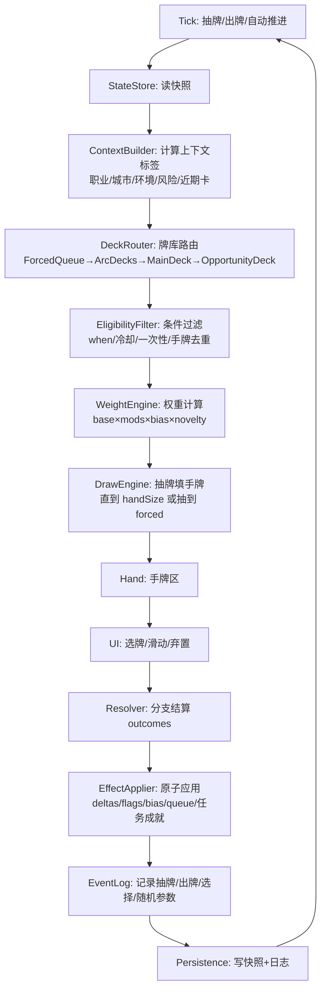
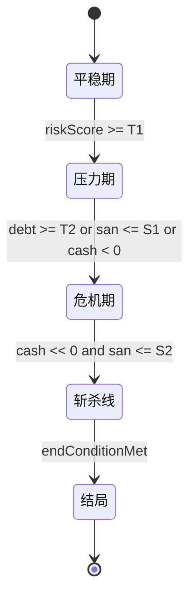
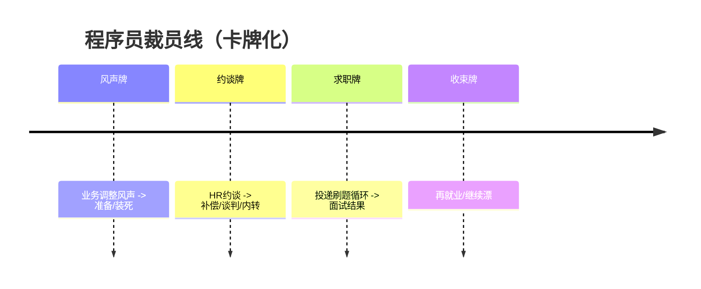
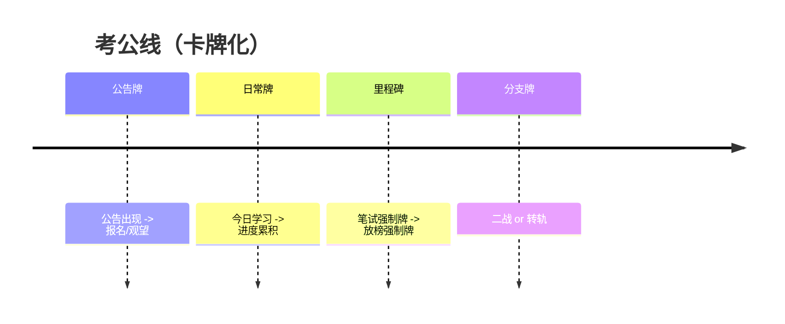
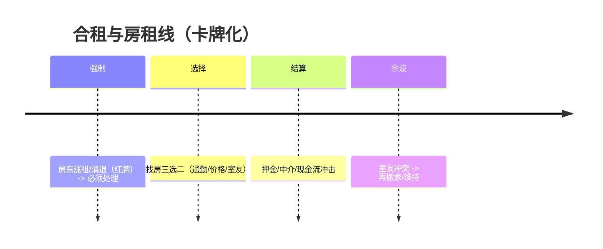
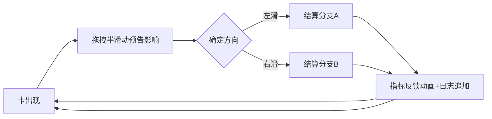

# 卡牌化交互的都市生存文字 MUD：事件引擎与 UI 重构交付方案

## 执行摘要

本报告输出一套可直接交给研发落地的“卡牌交互 + 链式事件引擎（Storylet/QBN）”重构方案，用于把当前偏“随机事件堆砌”的都市生存文字 MUD，升级为**可抽牌、可控风险、可形成因果链与叙事弧**、并具备长期内容扩容能力的系统。

核心方法论来自三类成熟实践与研究：  
- **Storylet/QBN（Quality-Based Narrative）**：以“故事块（storylets）+ 状态/品质（qualities）”组织海量内容，由状态决定可用性与后果，天然支持链式推进与可重复游玩。citeturn0search0turn0search1turn0search2turn0search3  
- **卡牌叙事件互**：用“抽牌/手牌/弃牌/强制牌”把复杂叙事调度变得可视、可预测、可策略化；典型参考为《堕落伦敦》（Fallen London）的机会牌与手牌管理，以及《王权》（Reigns）的单卡二选一滑动交互。citeturn3search4turn8search7turn2search1turn2search10  
- **国内语言与情绪素材**：以entity["organization","百度贴吧","interest forum app"]的“潮流玩梗/兴趣吧生态”作为语感参考（例如弱智吧、滑稽吧、段子吧等“造梗场”在官方商店描述中被直接点名），但采用“主题原型抽象 + 中性化改写”方式避开直接复刻。citeturn2search0  

已尝试对你提供的在线版本进行“最新事件样本采集与对比”。项目主页与游戏页静态内容可读取到玩法定位、指标面板、运行控制与分享机制，但事件文本与日志为前端动态渲染，静态 DOM 中显示“回合反馈：待开始/日志空”且缺少可抓取的真实事件序列，因此无法在当前条件下完成自动化“新旧事件链质量对比”。建议在引擎中加入**事件/卡牌日志导出（JSONL）与回放模式**以支撑调参与 A/B 验证。citeturn10view0turn10view1  

---

## 对标研究与设计原则

### 卡牌化叙事系统的可迁移要点

《王权》（Reigns）在其官方描述中强调：玩家通过**左右滑动**对一张“来访请求卡”作二选一决策，并需要在多条“势力/指标”之间维持平衡，否则立即结束；这套“单卡 + 二元抉择 + 指标反馈”的交互模型非常适合移动端高频决策循环，且天然支持“短局多轮、反复学习”的玩法结构。citeturn2search1turn2search10turn2search16  

《堕落伦敦》（Fallen London）的机会牌系统提供了另一种更“策划、可经营”的卡牌模型：  
- 机会牌有“机会牌库（deck）+ 手牌（hand）”概念，抽牌会把牌放入手牌；玩家可以“打出/弃置/保留”来影响后续抽牌体验。citeturn2search5turn8search5  
- Failbetter 的订阅 FAQ 明确提到：订阅用户获得“扩展机会牌库”，从“6 张”扩到“10 张”，说明“牌库容量/抽牌容量”本身就是可设计的成长与商业化杠杆。citeturn3search4  
- Failbetter 的平衡说明指出：如果玩家被激励去“修剪牌库、移除低价值牌”，会导致玩家为了不污染牌库而回避内容，反过来抑制你持续加内容的能力。因此“新增内容如何进入牌库、是否永久污染、是否可过期/可拒收”是卡牌化事件系统的生死线。citeturn8search7  

### Storylet/QBN：让“随机”变成“状态驱动的必然”

Emily Short 将 storylet 的核心循环概括为：遍历 storylets → 找出满足前置条件的 → 呈现一个随机抽样或列表 → 玩家选择 → 应用结果 → 回到循环。这对应我们要做的“候选卡过滤 + 加权抽牌 + 分支结算 + 状态更新”。citeturn0search2  
Kreminski & Wardrip-Fruin 的论文把 storylets 系统定义为“从可重排的离散叙事模块数据库中，根据状态动态装配叙事”，并将“选择架构/前置类型/显著性（salience）等维度”作为设计空间。citeturn0search3turn0search14  
学术与实践都指出 storylet 系统常见问题是缺少“through-line”（主线连贯），需要优先级、结构化约束与后续回收机制；这直接支撑本报告推荐的 **Queue→Arcs→Decks** 三层调度（后文详述）。citeturn3search2turn0search11turn0search3  

### 国内“现实梗”语感如何安全落地

entity["organization","百度贴吧","interest forum app"]官方商店描述强调其是“潮流兴趣社区”，并举例“弱智吧、滑稽吧、段子吧”可“创造神梗”，这说明“梗化表达 + 共鸣吐槽”是国内玩家熟悉的语言场景；用于你的游戏时应抽象为“情绪主题与句式节奏”，而不是复刻具体帖文。citeturn2search0  
对于你列举的“打工/失业/考公/房价/城市吧”等方向，贴吧确实存在对应兴趣吧并呈现持续活跃（例如公考类吧可见关注与贴子规模）。citeturn7search2turn6search10  

---

## 卡牌 + 事件引擎架构

### 总体架构：卡牌是 UI 载体，事件是可结算逻辑

我们建议把 **Card（卡牌）** 与 **Event（事件逻辑）** 拆分为两层：  
- Card：面向 UI 的“展示与交互单元”（标题、正文、左右选项文本、预告影响的指标、动效样式、是否可弃置等）。  
- Event：面向引擎的“条件与结果单元”（前置条件、权重、冷却、分支 outcomes、flags/bias/queue 更新）。  
它们以 `cardId == eventId` 或 `card.eventRef` 关联，便于内容作者只维护一套逻辑，同时允许 UI 皮肤化（同逻辑多文案/多语气包）。citeturn0search2turn13search0  

### 数据流与模块



上述模块化设计直接映射 Emily Short 描述的 storylet 循环，同时加入“牌库路由、手牌去重、弃置策略”等卡牌层能力。citeturn0search2turn2search5  

### 三层调度：强制后续、叙事弧、通用牌库

为解决“断链”和“随机堆砌”，采用以下优先级：

| 层级 | 来源 | 目的 | 参考依据 |
|---|---|---|---|
| ForcedQueue（强制队列） | 上一张牌 outcomes enqueue | 回收因果后续，保证连贯 | storylet through-line 需要结构约束；FL 也存在不可弃置/强制情境的讨论与机制变体 citeturn3search20turn8search5 |
| ArcDecks（叙事弧牌库） | 活跃弧 stage 控制 | 主线/支线阶段推进，形成完整故事 | Failbetter 用“进度品质/结构化叙事形态”组织链式内容 citeturn0search5turn0search11 |
| MainDeck（通用牌库） | 职业/城市/环境适配 | 提供变化与填充，形成可重复游玩 | storylets 作为可重排模块数据库 citeturn0search3 |
| OpportunityDeck（机会牌库） | 可选机会/副线 | 提供玩家策略空间与“爽点牌” | FL 的机会牌与玩家“保留/弃置/修剪”行为 citeturn8search5turn8search7 |

### 状态机：阶段与“斩杀线”连招

你的产品定位提到“现实压力推到终盘”，可显式化为阶段状态机，并把“斩杀线”体验建模为“阈值触发后强制牌连招”。citeturn10view0turn12search0  



“斩杀线”本身在中文语境中被描述为“一旦跌破关键点，会出现连锁反应/组合拳”，适合用 ForcedQueue 强制连招牌来表达。citeturn12search3turn12search7  

### 持久化：可回放是卡牌系统调参的底座

- Snapshot：回合数、数值状态、flags（含 TTL）、biasMap、活跃弧 stage、队列、手牌、冷却表、RNG 状态。  
- EventLog：每回合抽到哪些牌、打出哪张、选择方向、随机分叉、状态 delta 与 flags 变化。  

你当前页面已暴露“Seed/生存日志/事件轨迹/挑战链接”等结构位，但由于动态渲染，在静态抓取中无法获得真实事件样本；因此“内置日志导出”是你完成对标、回放与 A/B 的关键工程项。citeturn10view1turn0search2  

---

## 数据模型与 JSON/TS Schema

### 关键术语约定

- **卡牌（Card）**：UI 展示与交互。  
- **事件（Event）**：条件、权重、结果（outcomes）。  
- **品质/状态（Qualities/State）**：stats + flags + 资源（钱/债/热度等）。Failbetter 强调“保持 qualities 简约”，避免作者与玩家记忆负担。citeturn13search12  

### 卡牌系统字段表（面向作者与研发）

| 字段 | 类型 | 说明 | 备注 |
|---|---|---|---|
| id | string | 卡牌唯一 ID | 与 eventId 对齐 |
| deckTags | string[] | 牌库路由标签 | 例如 `deck:main` / `deck:opportunity` |
| rarity | enum | common/rare/epic | 影响权重与边框样式 |
| canDiscard | boolean | 是否允许弃置 | 借鉴 FL“可弃置/不可弃置”差异与玩家策略空间 citeturn8search5turn3search20 |
| swipe | object | 左右选项文本与预告影响 | 借鉴 Reigns 二选一滑动 citeturn2search1turn2search10 |
| event | EventDef | 逻辑定义 | 包含 when/weight/outcomes |

### TypeScript Schema（完整可落地版本）

```ts
// card_event_schema.ts

export type StatKey =
  | "hp" | "san" | "fatigue"
  | "debt" | "heat" | "cash"
  | "careerXP" | "examXP" | "social";

export type CompareOp = "==" | "!=" | ">" | ">=" | "<" | "<=" | "in" | "notIn";

export type Condition =
  | { all: Condition[] }
  | { any: Condition[] }
  | { not: Condition }
  | { stat: StatKey; op: CompareOp; value: number | number[] }
  | { flag: string; op: CompareOp; value: boolean | number | string | (string | number)[] }
  | { hasTag: string }            // career:dev, city:cd, env:econ, deck:main...
  | { rng: { chance: number } };  // 0..1

export interface FlagValue {
  v: boolean | number | string;
  ttl?: number;                   // 回合数；<=0 表示不过期
}

export interface WeightModifier {
  if?: Condition;
  add?: number;
  mul?: number;
  clampMin?: number;
  clampMax?: number;
}

export interface StatDelta {
  stat: StatKey;
  add: number;
  clampMin?: number;
  clampMax?: number;
}

export interface BiasDelta {
  key: string; // "tag:jobhunt" / "card:dev_hr_talk"
  mul: number;
  ttl: number;
}

export interface QueueItem {
  cardId: string;                 // 强制后续牌
  dueIn: number;
  priority: number;
  forced?: boolean;               // true=不可弃置、优先出牌
}

export interface Outcome {
  deltas?: StatDelta[];
  setFlags?: Record<string, FlagValue>;
  clearFlags?: string[];
  enqueue?: QueueItem[];
  bias?: BiasDelta[];
  arcStep?: Record<string, number>; // e.g. {"devLayoff": +1}
  text?: string;                    // 分支结算文案（可选）
}

export interface Choice {
  id: string;                      // left/right 或更多
  label: string;
  availableIf?: Condition;
  outcomes: Outcome[];
}

export type EventCategory = "daily" | "career" | "system" | "arc" | "ending";

export interface EventDef {
  id: string;
  version: number;
  category: EventCategory;
  tags: string[];

  when?: Condition;
  cooldown?: number;
  oncePerRun?: boolean;

  baseWeight: number;
  weightMods?: WeightModifier[];

  title: string;
  text: string;

  // 无选择时的自动结算
  autoOutcomes?: Outcome[];

  // 有选择则由 UI 触发结算
  choices?: Choice[];

  summaryTags?: string[];
}

export type CardRarity = "common" | "uncommon" | "rare" | "epic";

export interface SwipeSpec {
  leftLabel: string;
  rightLabel: string;
  // 预告：只提示会影响哪些指标，不暴露数值
  leftAffects?: StatKey[];
  rightAffects?: StatKey[];
  // 是否在“半滑动”时显示预告（Reigns 风格）
  previewOnDrag?: boolean;
}

export interface CardUI {
  layout: "reigns_single" | "hand_slot" | "forced_red";
  portraitKey?: string;           // 可选：头像/插画 key
  tonePack?: string;              // 可选：语气包（如“打工人/抽象”）
}

export interface CardDef {
  id: string;                     // cardId
  deckTags: string[];             // deck:main / deck:opportunity / deck:arc:devLayoff ...
  rarity: CardRarity;
  canDiscard: boolean;

  swipe: SwipeSpec;
  ui: CardUI;

  event: EventDef;
}

export interface DeckRule {
  id: string;                     // deck id
  // hand 模式：一次填满 N 张；single 模式：每回合只出一张
  mode: "hand" | "single";
  baseHandSize: number;
  maxHandSize: number;

  // 抽牌策略
  drawPerTurn: number;            // 每回合补几张（hand 模式）
  preventDuplicatesInHand: boolean;
  discardCooldownTurns: number;   // 弃置后最少 N 回合不再出现
}

export interface PlayerProfile {
  seed: string;
  cityId: string;
  careerId: string;
  goals: string[];
  traits?: string[];
}

export interface PlayerState {
  turn: number;
  stats: Record<StatKey, number>;
  flags: Record<string, FlagValue>;
  biasMap: Record<string, { mul: number; ttl: number }>;
  queue: QueueItem[];

  activeArcs: Record<string, { stage: number; ttl?: number }>;
  cooldowns: Record<string, number>;

  hand: string[];                 // 当前手牌 cardIds
  discardHistory: Record<string, number>; // cardId -> lastDiscardTurn
  recentCards: string[];          // 用于新鲜度惩罚
}
```

该 Schema 把 storylet/QBN 的“前置—结果—状态改变”与卡牌系统的“手牌/弃置/强制牌”统一建模，便于同一套内容同时支持移动端滑动与桌面端手牌选择。citeturn0search2turn2search10turn3search4  

---

## 抽牌与链式结算算法与样例卡池

### 抽牌与出牌核心循环（伪代码）

该算法满足：条件触发、加权选择、链式传播（queue+bias）、flags 设置/清理、分支结算、抽牌/手牌/弃牌机制；并结合 Failbetter 的经验避免“低价值永久污染牌库导致玩家回避内容”。citeturn8search7turn13search12  

```pseudo
function turnTick(inputAction?):
  s = loadSnapshot()
  ctx = buildContext(s) // career/city/env + stage + risk + recentCards

  # 0) 若用户在 UI 对某张牌做了选择或弃置
  if inputAction.type == "PLAY":
    resolvePlay(inputAction.cardId, inputAction.choiceId, s, ctx)
    endTurn(s)
    return
  if inputAction.type == "DISCARD":
    if !card.canDiscard: reject
    s.discardHistory[cardId] = s.turn
    removeFromHand(cardId)
    # 可选：弃置也算“轻度消耗”，避免无限刷
    endTurn(s, consume=false)
    return

  # 1) ForcedQueue：若有强制牌到期，直接塞入手牌并置顶
  forced = popDueForcedQueue(s.queue, s.turn)
  if forced exists:
    placeOnTopOfHand(forced.cardId)
    # forced card 通常不可弃置
    renderHand(s.hand)
    return

  # 2) 补手牌（hand 模式）
  while handNotFull(s) and drawnCount < deckRule.drawPerTurn:
    candidateCards = queryCardsByDeckPriority(ctx) # arc > main > opportunity
    eligible = filterByConditionsAndCooldown(candidateCards, s, ctx)
    eligible = filterDiscardCooldown(eligible, s.discardHistory, deckRule.discardCooldownTurns)
    eligible = preventDuplicatesInHand(eligible, s.hand)

    scored = []
    for c in eligible:
      w = c.event.baseWeight
      w = applyWeightMods(w, c.event.weightMods, s, ctx)
      w = applyBias(w, s.biasMap, c.event.tags, "card:"+c.id)
      w = w * noveltyPenalty(c.id, s.recentCards)  # 降低近期重复
      if w > 0: scored.add(c, w)

    picked = weightedSample(scored)
    addToHand(picked.id)

  # 3) 呈现手牌，由玩家选一张出牌；single 模式则直接呈现顶部牌
  renderHand(s.hand)

function resolvePlay(cardId, choiceId, s, ctx):
  card = getCard(cardId)
  out = resolveOutcomes(card.event, choiceId)

  atomic:
    applyDeltas(out.deltas)
    setFlagsWithTTL(out.setFlags); clearFlags(out.clearFlags)
    enqueueQueue(out.enqueue)      # 推进后续链条
    applyBias(out.bias)            # 余波：提高相关牌概率
    stepArcs(out.arcStep)
    updateCooldowns(card.event)
    removeFromHand(cardId)
    appendLog(cardId, choiceId, out)
```

### 关键参数推荐（初版可用）

这些参数直接影响“像王权那样爽快”还是“像堕落伦敦那样可经营”：

| 参数 | 推荐初值 | 意图 | 参考 |
|---|---:|---|---|
| 模式 | mobile=single；desktop=hand | 移动端减少决策负担，桌面端增强策略 | Reigns 单卡滑动；FL 手牌管理 citeturn2search1turn8search9 |
| baseHandSize | 1–3 | N 越大策略性越强，但也更慢 | FL 手牌大小与“可保留坏牌防抽到”策略讨论 citeturn3search8turn3search4 |
| discardCooldownTurns | 3–8 | 防止“弃掉立刻又抽到”挫败 | FL 社区讨论抽牌概率与重复、以及牌库优化行为 citeturn2search5turn8search7 |
| forced card 比例 | 平稳期低；危机期高 | 做出“斩杀线连招”压迫感 | 斩杀线组合拳语义与阈值连锁描述 citeturn12search3turn12search7 |

### 示例卡池文件结构（前端可直接加载）

```json
// content/index.json
{
  "schemaVersion": 1,
  "deckRules": "content/deck_rules.json",
  "cards": [
    "content/cards/dev_layoff_pack.json",
    "content/cards/exam_pack.json",
    "content/cards/housing_pack.json"
  ],
  "cities": "content/cities.json",
  "environments": "content/environments.json",
  "careers": "content/careers.json",
  "goals": "content/goals.json"
}
```

#### 样例链一：程序员裁员线（卡牌化）



```json
// content/cards/dev_layoff_pack.json
{
  "cards": [
    {
      "id": "card_dev_rumor",
      "deckTags": ["deck:arc:devLayoff"],
      "rarity": "common",
      "canDiscard": true,
      "swipe": {
        "leftLabel": "当没发生",
        "rightLabel": "开始准备",
        "leftAffects": ["san"],
        "rightAffects": ["san", "careerXP"],
        "previewOnDrag": true
      },
      "ui": { "layout": "reigns_single", "tonePack": "workplace_blackhumor" },
      "event": {
        "id": "card_dev_rumor",
        "version": 1,
        "category": "arc",
        "tags": ["career:dev", "layoff", "office", "stress"],
        "when": { "hasTag": "career:dev" },
        "cooldown": 6,
        "baseWeight": 8,
        "weightMods": [{ "if": { "hasTag": "env:econ_downturn" }, "mul": 1.4 }],
        "title": "业务调整的风声",
        "text": "周会上，老板反复强调“聚焦”和“降本”。空气里像有一条看不见的倒计时。",
        "choices": [
          {
            "id": "left",
            "label": "当没发生",
            "outcomes": [
              {
                "deltas": [{ "stat": "san", "add": -6, "clampMin": 0, "clampMax": 100 }],
                "setFlags": { "dev.rumor": { "v": true, "ttl": 10 } },
                "bias": [{ "key": "card:card_dev_hr", "mul": 1.6, "ttl": 6 }]
              }
            ]
          },
          {
            "id": "right",
            "label": "开始准备",
            "outcomes": [
              {
                "deltas": [
                  { "stat": "san", "add": -3, "clampMin": 0, "clampMax": 100 },
                  { "stat": "careerXP", "add": 2, "clampMin": 0, "clampMax": 999999 }
                ],
                "setFlags": { "dev.rumor": { "v": true, "ttl": 12 } },
                "bias": [
                  { "key": "tag:jobhunt", "mul": 1.3, "ttl": 10 },
                  { "key": "card:card_dev_hr", "mul": 2.0, "ttl": 8 }
                ],
                "enqueue": [{ "cardId": "card_dev_team_mood", "dueIn": 1, "priority": 50 }]
              }
            ]
          }
        ],
        "summaryTags": ["风声", "降本"]
      }
    },
    {
      "id": "card_dev_team_mood",
      "deckTags": ["deck:arc:devLayoff"],
      "rarity": "common",
      "canDiscard": true,
      "swipe": {
        "leftLabel": "继续埋头干活",
        "rightLabel": "改简历/刷题",
        "leftAffects": ["fatigue", "san"],
        "rightAffects": ["careerXP", "san"],
        "previewOnDrag": true
      },
      "ui": { "layout": "reigns_single" },
      "event": {
        "id": "card_dev_team_mood",
        "version": 1,
        "category": "arc",
        "tags": ["career:dev", "layoff", "office"],
        "when": { "flag": "dev.rumor", "op": "==", "value": true },
        "cooldown": 4,
        "baseWeight": 10,
        "title": "组内气氛异常",
        "text": "工位上突然多了很多“低头写东西”的人：改简历、刷题、算房租。",
        "choices": [
          {
            "id": "left",
            "label": "继续埋头干活",
            "outcomes": [
              {
                "deltas": [
                  { "stat": "fatigue", "add": 6, "clampMin": 0, "clampMax": 100 },
                  { "stat": "san", "add": -4, "clampMin": 0, "clampMax": 100 }
                ],
                "bias": [{ "key": "card:card_dev_hr", "mul": 1.4, "ttl": 6 }]
              }
            ]
          },
          {
            "id": "right",
            "label": "改简历/刷题",
            "outcomes": [
              {
                "deltas": [
                  { "stat": "careerXP", "add": 4, "clampMin": 0, "clampMax": 999999 },
                  { "stat": "san", "add": -2, "clampMin": 0, "clampMax": 100 }
                ],
                "bias": [{ "key": "tag:jobhunt", "mul": 1.5, "ttl": 8 }]
              }
            ]
          }
        ],
        "summaryTags": ["办公室", "焦虑"]
      }
    },
    {
      "id": "card_dev_hr",
      "deckTags": ["deck:arc:devLayoff"],
      "rarity": "uncommon",
      "canDiscard": false,
      "swipe": {
        "leftLabel": "拿补偿走人",
        "rightLabel": "谈判",
        "leftAffects": ["cash", "san", "debt"],
        "rightAffects": ["heat", "san"],
        "previewOnDrag": true
      },
      "ui": { "layout": "forced_red" },
      "event": {
        "id": "card_dev_hr",
        "version": 1,
        "category": "arc",
        "tags": ["career:dev", "layoff", "hr", "choice"],
        "when": { "flag": "dev.rumor", "op": "==", "value": true },
        "oncePerRun": true,
        "baseWeight": 6,
        "title": "HR 约谈",
        "text": "邮件标题很短：『沟通一下』。你听懂了：这是一场成本结算。",
        "choices": [
          {
            "id": "left",
            "label": "拿补偿走人",
            "outcomes": [
              {
                "deltas": [
                  { "stat": "cash", "add": 18000, "clampMin": -999999, "clampMax": 999999 },
                  { "stat": "debt", "add": -6000, "clampMin": 0, "clampMax": 999999 },
                  { "stat": "san", "add": -8, "clampMin": 0, "clampMax": 100 }
                ],
                "setFlags": { "life.unemployed": { "v": true, "ttl": 18 } },
                "enqueue": [{ "cardId": "card_dev_apply_loop", "dueIn": 1, "priority": 80 }]
              }
            ]
          },
          {
            "id": "right",
            "label": "谈判",
            "outcomes": [
              {
                "deltas": [
                  { "stat": "heat", "add": 10, "clampMin": 0, "clampMax": 100 },
                  { "stat": "san", "add": -4, "clampMin": 0, "clampMax": 100 }
                ],
                "enqueue": [{ "cardId": "card_dev_pkg_result", "dueIn": 1, "priority": 90, "forced": true }]
              }
            ]
          }
        ],
        "summaryTags": ["约谈"]
      }
    },
    {
      "id": "card_dev_pkg_result",
      "deckTags": ["deck:arc:devLayoff"],
      "rarity": "rare",
      "canDiscard": false,
      "swipe": {
        "leftLabel": "接受（略高）",
        "rightLabel": "继续硬刚",
        "leftAffects": ["cash", "debt", "san"],
        "rightAffects": ["heat", "san"],
        "previewOnDrag": true
      },
      "ui": { "layout": "forced_red" },
      "event": {
        "id": "card_dev_pkg_result",
        "version": 1,
        "category": "arc",
        "tags": ["career:dev", "layoff", "milestone"],
        "oncePerRun": true,
        "baseWeight": 1,
        "title": "谈判结果",
        "text": "方案来了：给你台阶，也给你边界。",
        "choices": [
          {
            "id": "left",
            "label": "接受（略高）",
            "outcomes": [
              {
                "deltas": [
                  { "stat": "cash", "add": 26000, "clampMin": -999999, "clampMax": 999999 },
                  { "stat": "debt", "add": -8000, "clampMin": 0, "clampMax": 999999 },
                  { "stat": "san", "add": -6, "clampMin": 0, "clampMax": 100 }
                ],
                "setFlags": { "life.unemployed": { "v": true, "ttl": 18 } },
                "enqueue": [{ "cardId": "card_dev_apply_loop", "dueIn": 1, "priority": 80 }]
              }
            ]
          },
          {
            "id": "right",
            "label": "继续硬刚",
            "outcomes": [
              {
                "deltas": [
                  { "stat": "heat", "add": 18, "clampMin": 0, "clampMax": 100 },
                  { "stat": "san", "add": -10, "clampMin": 0, "clampMax": 100 }
                ],
                "enqueue": [{ "cardId": "card_dev_forced_exit", "dueIn": 1, "priority": 100, "forced": true }]
              }
            ]
          }
        ],
        "summaryTags": ["里程碑"]
      }
    },
    {
      "id": "card_dev_apply_loop",
      "deckTags": ["deck:arc:devLayoff", "deck:main"],
      "rarity": "common",
      "canDiscard": true,
      "swipe": {
        "leftLabel": "高强度刷题",
        "rightLabel": "休息一天",
        "leftAffects": ["careerXP", "fatigue", "san"],
        "rightAffects": ["san", "cash"],
        "previewOnDrag": true
      },
      "ui": { "layout": "reigns_single" },
      "event": {
        "id": "card_dev_apply_loop",
        "version": 1,
        "category": "arc",
        "tags": ["career:dev", "jobhunt", "choice"],
        "when": { "flag": "life.unemployed", "op": "==", "value": true },
        "cooldown": 2,
        "baseWeight": 12,
        "title": "投递与刷题",
        "text": "你把简历做了三套版本：保守、进攻、玄学。",
        "choices": [
          {
            "id": "left",
            "label": "高强度刷题",
            "outcomes": [
              {
                "deltas": [
                  { "stat": "careerXP", "add": 6, "clampMin": 0, "clampMax": 999999 },
                  { "stat": "fatigue", "add": 10, "clampMin": 0, "clampMax": 100 },
                  { "stat": "san", "add": -5, "clampMin": 0, "clampMax": 100 }
                ],
                "enqueue": [{ "cardId": "card_dev_offer", "dueIn": 1, "priority": 60 }]
              }
            ]
          },
          {
            "id": "right",
            "label": "休息一天",
            "outcomes": [
              {
                "deltas": [
                  { "stat": "san", "add": 6, "clampMin": 0, "clampMax": 100 },
                  { "stat": "cash", "add": -1200, "clampMin": -999999, "clampMax": 999999 }
                ]
              }
            ]
          }
        ],
        "summaryTags": ["求职"]
      }
    },
    {
      "id": "card_dev_offer",
      "deckTags": ["deck:arc:devLayoff"],
      "rarity": "uncommon",
      "canDiscard": false,
      "swipe": {
        "leftLabel": "拿到 Offer",
        "rightLabel": "被拒",
        "leftAffects": ["cash", "san"],
        "rightAffects": ["san", "cash"],
        "previewOnDrag": false
      },
      "ui": { "layout": "forced_red" },
      "event": {
        "id": "card_dev_offer",
        "version": 1,
        "category": "arc",
        "tags": ["career:dev", "jobhunt", "milestone"],
        "when": { "flag": "life.unemployed", "op": "==", "value": true },
        "baseWeight": 1,
        "title": "面试结果",
        "text": "电话那头说：我们很欣赏你，但……",
        "choices": [
          {
            "id": "left",
            "label": "拿到 Offer",
            "availableIf": { "any": [
              { "stat": "careerXP", "op": ">=", "value": 12 },
              { "rng": { "chance": 0.25 } }
            ]},
            "outcomes": [
              {
                "deltas": [
                  { "stat": "cash", "add": 8000, "clampMin": -999999, "clampMax": 999999 },
                  { "stat": "san", "add": 12, "clampMin": 0, "clampMax": 100 }
                ],
                "clearFlags": ["life.unemployed"],
                "setFlags": { "life.employed": { "v": true, "ttl": 999 } }
              }
            ]
          },
          {
            "id": "right",
            "label": "被拒",
            "outcomes": [
              {
                "deltas": [
                  { "stat": "san", "add": -8, "clampMin": 0, "clampMax": 100 },
                  { "stat": "cash", "add": -600, "clampMin": -999999, "clampMax": 999999 }
                ]
              }
            ]
          }
        ],
        "summaryTags": ["结果"]
      }
    }
  ]
}
```

#### 样例链二：考公线（卡牌化）

考公线天然适配“进度品质 + 里程碑强制牌”的结构，类似 Failbetter 所述“进度品质驱动的结构化叙事”。citeturn0search5turn13search12  



```json
// content/cards/exam_pack.json
{
  "cards": [
    {
      "id": "card_exam_notice",
      "deckTags": ["deck:arc:exam", "deck:main"],
      "rarity": "common",
      "canDiscard": true,
      "swipe": {
        "leftLabel": "观望",
        "rightLabel": "报名",
        "leftAffects": ["san"],
        "rightAffects": ["san", "examXP"],
        "previewOnDrag": true
      },
      "ui": { "layout": "reigns_single", "tonePack": "exam_pressure" },
      "event": {
        "id": "card_exam_notice",
        "version": 1,
        "category": "arc",
        "tags": ["exam", "choice", "family"],
        "cooldown": 8,
        "baseWeight": 7,
        "weightMods": [{ "if": { "hasTag": "env:exam_fever" }, "mul": 1.6 }],
        "title": "公告弹出来了",
        "text": "你刷到一条消息：岗位不少，但竞争更狠。你看着“稳定”两个字，像看见一条又窄又长的桥。",
        "choices": [
          {
            "id": "left",
            "label": "观望",
            "outcomes": [{ "deltas": [{ "stat": "san", "add": 2, "clampMin": 0, "clampMax": 100 }] }]
          },
          {
            "id": "right",
            "label": "报名",
            "outcomes": [
              {
                "setFlags": { "exam.active": { "v": true, "ttl": 999 } },
                "deltas": [{ "stat": "examXP", "add": 3, "clampMin": 0, "clampMax": 999999 }, { "stat": "san", "add": -2, "clampMin": 0, "clampMax": 100 }],
                "enqueue": [{ "cardId": "card_exam_daily", "dueIn": 1, "priority": 60 }]
              }
            ]
          }
        ],
        "summaryTags": ["公告"]
      }
    },
    {
      "id": "card_exam_daily",
      "deckTags": ["deck:arc:exam"],
      "rarity": "common",
      "canDiscard": true,
      "swipe": {
        "leftLabel": "高强度",
        "rightLabel": "稳步推进",
        "leftAffects": ["examXP", "san", "fatigue"],
        "rightAffects": ["examXP", "san"],
        "previewOnDrag": true
      },
      "ui": { "layout": "reigns_single" },
      "event": {
        "id": "card_exam_daily",
        "version": 1,
        "category": "arc",
        "tags": ["exam", "daily", "choice"],
        "when": { "flag": "exam.active", "op": "==", "value": true },
        "cooldown": 1,
        "baseWeight": 12,
        "title": "今天学不学？",
        "text": "你面前是题库和笔记。你知道进度会积累，崩溃也会。",
        "choices": [
          {
            "id": "left",
            "label": "高强度",
            "outcomes": [
              {
                "deltas": [
                  { "stat": "examXP", "add": 8, "clampMin": 0, "clampMax": 999999 },
                  { "stat": "san", "add": -6, "clampMin": 0, "clampMax": 100 },
                  { "stat": "fatigue", "add": 6, "clampMin": 0, "clampMax": 100 }
                ],
                "bias": [{ "key": "tag:family_pressure", "mul": 1.3, "ttl": 6 }]
              }
            ]
          },
          {
            "id": "right",
            "label": "稳步推进",
            "outcomes": [
              {
                "deltas": [
                  { "stat": "examXP", "add": 5, "clampMin": 0, "clampMax": 999999 },
                  { "stat": "san", "add": -2, "clampMin": 0, "clampMax": 100 }
                ]
              }
            ]
          }
        ],
        "summaryTags": ["备考"]
      }
    },
    {
      "id": "card_exam_written",
      "deckTags": ["deck:arc:exam"],
      "rarity": "rare",
      "canDiscard": false,
      "swipe": {
        "leftLabel": "稳住节奏",
        "rightLabel": "拼到最后",
        "leftAffects": ["san", "fatigue"],
        "rightAffects": ["san", "fatigue"],
        "previewOnDrag": true
      },
      "ui": { "layout": "forced_red" },
      "event": {
        "id": "card_exam_written",
        "version": 1,
        "category": "arc",
        "tags": ["exam", "milestone", "choice"],
        "when": { "all": [
          { "flag": "exam.active", "op": "==", "value": true },
          { "stat": "examXP", "op": ">=", "value": 25 }
        ]},
        "oncePerRun": true,
        "baseWeight": 4,
        "title": "笔试那天",
        "text": "你提前一小时到考点。你突然想：这条路上，所有人都在假装不紧张。",
        "choices": [
          {
            "id": "left",
            "label": "稳住节奏",
            "outcomes": [
              {
                "deltas": [{ "stat": "san", "add": -4, "clampMin": 0, "clampMax": 100 }, { "stat": "fatigue", "add": 6, "clampMin": 0, "clampMax": 100 }],
                "enqueue": [{ "cardId": "card_exam_result", "dueIn": 1, "priority": 90, "forced": true }]
              }
            ]
          },
          {
            "id": "right",
            "label": "拼到最后",
            "outcomes": [
              {
                "deltas": [{ "stat": "san", "add": -8, "clampMin": 0, "clampMax": 100 }, { "stat": "fatigue", "add": 10, "clampMin": 0, "clampMax": 100 }],
                "enqueue": [{ "cardId": "card_exam_result", "dueIn": 1, "priority": 90, "forced": true }]
              }
            ]
          }
        ],
        "summaryTags": ["笔试"]
      }
    },
    {
      "id": "card_exam_result",
      "deckTags": ["deck:arc:exam"],
      "rarity": "rare",
      "canDiscard": false,
      "swipe": {
        "leftLabel": "进面",
        "rightLabel": "落榜",
        "leftAffects": ["san", "social"],
        "rightAffects": ["san"],
        "previewOnDrag": false
      },
      "ui": { "layout": "forced_red" },
      "event": {
        "id": "card_exam_result",
        "version": 1,
        "category": "arc",
        "tags": ["exam", "milestone"],
        "oncePerRun": true,
        "baseWeight": 1,
        "title": "放榜",
        "text": "名单出来了。",
        "choices": [
          {
            "id": "left",
            "label": "进面",
            "availableIf": { "any": [
              { "stat": "examXP", "op": ">=", "value": 40 },
              { "rng": { "chance": 0.28 } }
            ]},
            "outcomes": [
              {
                "deltas": [{ "stat": "san", "add": 10, "clampMin": 0, "clampMax": 100 }, { "stat": "social", "add": 2, "clampMin": 0, "clampMax": 999999 }],
                "setFlags": { "exam.interview": { "v": true, "ttl": 10 } }
              }
            ]
          },
          {
            "id": "right",
            "label": "落榜",
            "outcomes": [
              {
                "deltas": [{ "stat": "san", "add": -12, "clampMin": 0, "clampMax": 100 }],
                "enqueue": [{ "cardId": "card_exam_retry", "dueIn": 1, "priority": 70, "forced": true }]
              }
            ]
          }
        ],
        "summaryTags": ["放榜"]
      }
    },
    {
      "id": "card_exam_retry",
      "deckTags": ["deck:arc:exam"],
      "rarity": "uncommon",
      "canDiscard": false,
      "swipe": {
        "leftLabel": "二战",
        "rightLabel": "止损转轨",
        "leftAffects": ["san", "examXP"],
        "rightAffects": ["san"],
        "previewOnDrag": true
      },
      "ui": { "layout": "forced_red" },
      "event": {
        "id": "card_exam_retry",
        "version": 1,
        "category": "arc",
        "tags": ["exam", "choice", "ending_soft"],
        "oncePerRun": true,
        "baseWeight": 1,
        "title": "要不要二战？",
        "text": "你意识到：你不只是考一个岗位，你在考一种生活的可能性。",
        "choices": [
          {
            "id": "left",
            "label": "二战",
            "outcomes": [{ "deltas": [{ "stat": "san", "add": -6, "clampMin": 0, "clampMax": 100 }, { "stat": "examXP", "add": 8, "clampMin": 0, "clampMax": 999999 }] }]
          },
          {
            "id": "right",
            "label": "止损",
            "outcomes": [{ "setFlags": { "exam.locked": { "v": true, "ttl": 999 } }, "deltas": [{ "stat": "san", "add": 2, "clampMin": 0, "clampMax": 100 }] }]
          }
        ],
        "summaryTags": ["二战"]
      }
    }
  ]
}
```

#### 样例链三：合租/房租/房价线（卡牌化）

这条线建议用“强制牌（涨租/清退）→ 找房选择 → 签约支出 → 室友冲突”的连续队列回收，保证现实压迫感；同时避免把“低价值垃圾牌”永久塞满机会牌库，否则会触发玩家“剪枝/回避内容”的行为（Failbetter 已明确提出这种副作用）。citeturn8search7turn8search9  



```json
// content/cards/housing_pack.json
{
  "cards": [
    {
      "id": "card_rent_notice",
      "deckTags": ["deck:forced", "deck:arc:housing"],
      "rarity": "uncommon",
      "canDiscard": false,
      "swipe": {
        "leftLabel": "硬扛涨租",
        "rightLabel": "搬家",
        "leftAffects": ["cash", "san"],
        "rightAffects": ["fatigue", "cash"],
        "previewOnDrag": true
      },
      "ui": { "layout": "forced_red", "tonePack": "urban_survival" },
      "event": {
        "id": "card_rent_notice",
        "version": 1,
        "category": "system",
        "tags": ["housing", "rent", "forced", "choice"],
        "cooldown": 10,
        "baseWeight": 5,
        "weightMods": [{ "if": { "hasTag": "env:housing_shake" }, "mul": 1.8 }],
        "title": "房东发来消息",
        "text": "房东说：下个月要涨租，或者你们提前走也行。语气很客气，意思很明确：选择权不在你。",
        "choices": [
          {
            "id": "left",
            "label": "硬扛涨租",
            "availableIf": { "stat": "cash", "op": ">=", "value": 1500 },
            "outcomes": [
              {
                "deltas": [
                  { "stat": "cash", "add": -1500, "clampMin": -999999, "clampMax": 999999 },
                  { "stat": "san", "add": -3, "clampMin": 0, "clampMax": 100 }
                ],
                "setFlags": { "housing.stable": { "v": true, "ttl": 8 } }
              }
            ]
          },
          {
            "id": "right",
            "label": "搬家",
            "outcomes": [
              {
                "setFlags": { "housing.searching": { "v": true, "ttl": 12 } },
                "enqueue": [{ "cardId": "card_house_hunt", "dueIn": 1, "priority": 90, "forced": true }]
              }
            ]
          }
        ],
        "summaryTags": ["涨租"]
      }
    },
    {
      "id": "card_house_hunt",
      "deckTags": ["deck:arc:housing"],
      "rarity": "common",
      "canDiscard": false,
      "swipe": {
        "leftLabel": "离工作近（贵）",
        "rightLabel": "合租（省）",
        "leftAffects": ["cash", "fatigue"],
        "rightAffects": ["cash", "san"],
        "previewOnDrag": true
      },
      "ui": { "layout": "forced_red" },
      "event": {
        "id": "card_house_hunt",
        "version": 1,
        "category": "arc",
        "tags": ["housing", "choice", "commute"],
        "when": { "flag": "housing.searching", "op": "==", "value": true },
        "baseWeight": 1,
        "title": "开始找房",
        "text": "你发现租房只有三件事：通勤、价格、室友。你最多能同时拥有两件。",
        "choices": [
          {
            "id": "left",
            "label": "离工作近",
            "outcomes": [
              {
                "deltas": [
                  { "stat": "cash", "add": -2000, "clampMin": -999999, "clampMax": 999999 },
                  { "stat": "fatigue", "add": -4, "clampMin": 0, "clampMax": 100 }
                ],
                "enqueue": [{ "cardId": "card_sign_contract", "dueIn": 1, "priority": 80, "forced": true }]
              }
            ]
          },
          {
            "id": "right",
            "label": "合租",
            "outcomes": [
              {
                "deltas": [{ "stat": "cash", "add": -1100, "clampMin": -999999, "clampMax": 999999 }],
                "setFlags": { "housing.roommate": { "v": true, "ttl": 20 } },
                "enqueue": [
                  { "cardId": "card_sign_contract", "dueIn": 1, "priority": 80, "forced": true },
                  { "cardId": "card_roommate_conflict", "dueIn": 2, "priority": 70 }
                ]
              }
            ]
          }
        ],
        "summaryTags": ["找房"]
      }
    },
    {
      "id": "card_sign_contract",
      "deckTags": ["deck:arc:housing"],
      "rarity": "uncommon",
      "canDiscard": false,
      "swipe": {
        "leftLabel": "咬牙付款",
        "rightLabel": "借钱补洞",
        "leftAffects": ["cash", "san"],
        "rightAffects": ["debt", "san"],
        "previewOnDrag": true
      },
      "ui": { "layout": "forced_red" },
      "event": {
        "id": "card_sign_contract",
        "version": 1,
        "category": "arc",
        "tags": ["housing", "contract", "choice"],
        "baseWeight": 1,
        "title": "签合同与押金",
        "text": "押一付三、服务费、杂项。你看着付款页面：钱不够的时候，规则特别清晰。",
        "choices": [
          {
            "id": "left",
            "label": "咬牙付款",
            "outcomes": [
              {
                "deltas": [
                  { "stat": "cash", "add": -1200, "clampMin": -999999, "clampMax": 999999 },
                  { "stat": "san", "add": -2, "clampMin": 0, "clampMax": 100 }
                ],
                "clearFlags": ["housing.searching"],
                "setFlags": { "housing.stable": { "v": true, "ttl": 10 } }
              }
            ]
          },
          {
            "id": "right",
            "label": "借钱补洞",
            "outcomes": [
              {
                "deltas": [
                  { "stat": "debt", "add": 3000, "clampMin": 0, "clampMax": 999999 },
                  { "stat": "san", "add": -4, "clampMin": 0, "clampMax": 100 }
                ],
                "clearFlags": ["housing.searching"],
                "setFlags": { "housing.stable": { "v": true, "ttl": 10 } }
              }
            ]
          }
        ],
        "summaryTags": ["押金"]
      }
    },
    {
      "id": "card_roommate_conflict",
      "deckTags": ["deck:arc:housing", "deck:opportunity"],
      "rarity": "common",
      "canDiscard": true,
      "swipe": {
        "leftLabel": "沟通",
        "rightLabel": "爆发",
        "leftAffects": ["san", "social"],
        "rightAffects": ["heat", "san"],
        "previewOnDrag": true
      },
      "ui": { "layout": "hand_slot" },
      "event": {
        "id": "card_roommate_conflict",
        "version": 1,
        "category": "arc",
        "tags": ["housing", "roommate", "choice"],
        "when": { "flag": "housing.roommate", "op": "==", "value": true },
        "cooldown": 6,
        "baseWeight": 10,
        "title": "室友变量开始生效",
        "text": "室友把公共区域当成“暂存区”，你把它当成“生存区”。你们都没错，只是都很累。",
        "choices": [
          {
            "id": "left",
            "label": "沟通",
            "availableIf": { "stat": "san", "op": ">=", "value": 20 },
            "outcomes": [
              {
                "deltas": [
                  { "stat": "san", "add": 3, "clampMin": 0, "clampMax": 100 },
                  { "stat": "social", "add": 2, "clampMin": 0, "clampMax": 999999 }
                ],
                "setFlags": { "housing.roommate.peace": { "v": true, "ttl": 8 } }
              }
            ]
          },
          {
            "id": "right",
            "label": "爆发",
            "outcomes": [
              {
                "deltas": [
                  { "stat": "heat", "add": 10, "clampMin": 0, "clampMax": 100 },
                  { "stat": "san", "add": -8, "clampMin": 0, "clampMax": 100 }
                ],
                "enqueue": [{ "cardId": "card_move_again", "dueIn": 2, "priority": 70 }]
              }
            ]
          }
        ],
        "summaryTags": ["室友", "冲突"]
      }
    },
    {
      "id": "card_move_again",
      "deckTags": ["deck:arc:housing"],
      "rarity": "uncommon",
      "canDiscard": false,
      "swipe": {
        "leftLabel": "继续漂",
        "rightLabel": "先苟住",
        "leftAffects": ["fatigue", "cash"],
        "rightAffects": ["san"],
        "previewOnDrag": true
      },
      "ui": { "layout": "forced_red" },
      "event": {
        "id": "card_move_again",
        "version": 1,
        "category": "arc",
        "tags": ["housing", "ending_soft"],
        "baseWeight": 1,
        "title": "再次搬家",
        "text": "你开始怀疑：是不是城市不适合你？后来你又想起：也许只是你没有足够的钱来适配城市。",
        "choices": [
          {
            "id": "left",
            "label": "继续漂",
            "outcomes": [
              {
                "deltas": [
                  { "stat": "fatigue", "add": 8, "clampMin": 0, "clampMax": 100 },
                  { "stat": "cash", "add": -800, "clampMin": -999999, "clampMax": 999999 }
                ],
                "setFlags": { "housing.searching": { "v": true, "ttl": 10 } },
                "enqueue": [{ "cardId": "card_house_hunt", "dueIn": 1, "priority": 80, "forced": true }]
              }
            ]
          },
          {
            "id": "right",
            "label": "先苟住",
            "outcomes": [
              { "deltas": [{ "stat": "san", "add": -2, "clampMin": 0, "clampMax": 100 }], "text": "你决定先把今天过完。明天再说。" }
            ]
          }
        ],
        "summaryTags": ["搬家"]
      }
    }
  ]
}
```

---

## 卡牌 UI 原型、动效规范与 A/B 计划

> 这一节聚焦“现代卡牌 UI”，并把引擎输出的 CardDef/hand/queue 显性化，让玩家感到“我抽到的是一种现实处境，不是随机段子”。

### 三套卡牌 UI 原型

#### 紧凑移动端（单卡滑动）

**目标**：最大化“像王权一样顺滑”的单手操作；玩家每回合只面对一张卡，左右滑二选一；半滑动预告影响指标。citeturn2search1turn2search10  

**组件清单**  
- 顶部：6 个指标条（hp/san/fatigue/debt/heat/cash）+ Turn/阶段  
- 中部：单张卡（标题、正文 3–5 行、左右选项提示）  
- 卡底：影响预告（左/右各 1–3 个指标图标）  
- 右上角：强制后续提示（来自 queue：例如“下一回合将出现：HR 方案”）  
- 底部：辅助按钮（撤销/暂停/设置/无障碍按钮选择）

**交互流**  


#### 叙事桌面端（手牌 + 轨迹）

**目标**：给重度玩家“策略与复盘”，借鉴堕落伦敦式“手牌管理/保留坏牌/弃置”策略空间，但要避免“手牌膨胀与不可弃置卡过多导致体验崩坏”的问题（FL 社区讨论中过多不可弃置/冲突牌会造成 hand-bloat）。citeturn3search11turn3search8  

**组件清单**  
- 左侧：指标/阶段/活跃弧线（arc stage）  
- 中央：当前出牌区（放大展示选中的牌）  
- 下方：手牌区（3–5 张，点击出牌；hover 显示触发因子与影响预告）  
- 右侧：事件轨迹（仅里程碑卡可展开全文）+ 任务/成就

#### 混合模式（主卡滑动 + 机会手牌）

**目标**：移动端保留“单卡爽快”，同时引入“机会手牌”给玩家一点可控性：主线/强制卡按顺序出现，机会牌在侧边手牌里可“保留/弃置/延后”。这等价于把“Reigns 的主卡流”与“FL 的机会手牌”组合。citeturn2search1turn8search7turn3search4  

**组件清单**  
- 主卡：滑动二选一（强制队列与弧线优先）  
- 机会手牌：2–3 张小卡，可点开变主卡或直接弃置  
- 机会牌刷新：按回合补 1 张（可在设置中调节“手牌策略偏好”）

image_group{"layout":"carousel","aspect_ratio":"16:9","query":["Reigns game swipe card interface screenshot","Fallen London opportunity deck hand screenshot","mobile swipe card decision game UI","narrative card game interface"],"num_per_query":1}

### 动效与反馈规范（可直接写进前端规范）

- 抽牌：从“牌堆”位置滑入；新牌入手牌槽位；新牌入场时优先展示标题，正文延迟 80–120ms 渐显（避免一屏文字瞬间闪烁）。  
- 半滑动预告：拖拽 15–25% 距离时显示“影响哪些指标”的 icon 高亮；拖拽越深提示越明确，但不显示数值（减少算计感）。此做法与 Reigns 的“滑动预览后果”生态相符。citeturn2search10turn2search1  
- 结算反馈：  
  - 指标条“轻微抖动/涨落动画”与正文下方一行“结算句”；  
  - 强制后续（queue）以“红色角标/不可弃置提示”标识，类似 FL 的“特殊牌不可随意处理”的玩法变体讨论。citeturn3search20turn8search5  
- 失败/结局：禁止长动画；一屏结算卡 + 可展开的“轨迹时间线”；你现有“战报图/挑战链接”结构位可直接承接。citeturn10view1turn10view0  

### UI 改版的 A/B 测试方案

NN/g 将 A/B 测试定义为：用真实流量对比两个或多个设计版本，以预先确定的业务指标评估哪个更好；并建议用 UX 研究辅助构造更强的变体。citeturn5search1turn5search8  

**实验分组**  
- A：现有（非卡牌或弱卡牌）  
- B：紧凑移动端单卡滑动  
- C：混合模式（主卡滑动 + 机会手牌）

**关键指标（建议落到埋点字典）**  
- 留存：Day1/Day7（安装当日 cohort 的 DayN 回访率定义可按 GameAnalytics）citeturn5search4  
- 单局深度：平均回合数、平均有效决策数  
- 链式质量：ArcCompletionRate（叙事弧收束率）、QueueHitRate（强制后续命中率）  
- 卡牌多样性：CardUsageDiversity（不同卡的使用分布熵/Gini）、EventNovelty（N 回合内重复率）。多样性指标可参考“场景多样性度量”的研究综述方向。citeturn5search3  
- 分享：战报图生成/复制文案/复制挑战链接转化（你页面已有对应入口）。citeturn10view1  

---

## 文案本地化、测试指标、工具链与合规运营

### 文案与本地化：短块、奖励式文本、梗味来自节奏而非复刻

Failbetter 的写作建议强调：文本是玩法奖励，成功文本可以比失败更“值得读”；同时要控制 chunk 的长度与节奏，让玩家在高频循环中仍愿意阅读。citeturn13search0turn13search4  
结合entity["organization","百度贴吧","interest forum app"]“潮流玩梗”生态（官方描述直接举例弱智吧/滑稽吧/段子吧），建议用三层文本结构：  
- **逻辑层**（不变）：同一张卡的条件、结果、后续链。  
- **语气层**（可切换 tonePack）：打工人风/抽象风/冷幽默风/严肃现实风。citeturn2search0  
- **安全层**：所有“现实吐槽”只表达处境与情绪，不做指向具体个人/企业的断言式内容；敏感主题由“主题原型抽象”承接（见下）。citeturn4search1  

### 可分享的“结算卡”格式（卡牌化战报）

你的项目主页明确强调“每局结束可导出战报图和文字总结”，建议把结算卡也做成一张“可复盘卡”，包含关键弧线、关键卡牌与最影响结局的选择。citeturn10view0turn10view1  

```json
// content/summary_card.json (render input)
{
  "runId": "20260226-8f3c",
  "seed": "DEV-114514",
  "turnsSurvived": 38,
  "cityId": "sh",
  "careerId": "dev",
  "environmentId": "econ_downturn",
  "finalStats": {
    "hp": 62,
    "san": 18,
    "fatigue": 74,
    "debt": 12000,
    "heat": 35,
    "cash": 3800,
    "careerXP": 20,
    "examXP": 0,
    "social": 6
  },
  "arcOutcomes": {
    "devLayoff": "再就业（低精神）",
    "housing": "住处短稳"
  },
  "mostImpactCards": [
    { "cardId": "card_dev_hr", "choice": "left" },
    { "cardId": "card_rent_notice", "choice": "right" }
  ],
  "highlights": [
    "风声 → 约谈 → 体面离场",
    "涨租强制牌触发 1 次",
    "求职循环 5 回合"
  ],
  "memeTags": ["降本", "押金", "投递"],
  "shareText": "你撑了 38 回合：没倒下，但也没赢。"
}
```

### 测试策略：可回放 + 仿真 + 内容可达性

1) **确定性回放**：固定 seed + 选择序列必须复现同一结局；这是“挑战链接/复盘”可信度的基础，也是 storylet 系统调参的必需工程。citeturn10view0turn0search2  
2) **蒙特卡洛仿真**：批量跑 1e4–1e5 局，统计：ArcCompletionRate、QueueHitRate、事件重复率、手牌弃置率、卡牌使用分布（熵/Gini）。多样性度量方向可参考“场景多样性指标综述”。citeturn5search3  
3) **内容可达性检查**：每张卡的触发次数、每个分支的选择次数、强制牌是否被正确回收（dueIn/priority）。Failbetter 的经验显示：如果内容“污染牌库”或玩法激励导致玩家回避新内容，会从系统层阻碍内容增长，因此要把“卡牌加入牌库的方式”也纳入测试断言。citeturn8search7  

### 性能与可扩展：从 200 张牌扩到 2000 张牌

- 按 `deckTags / tags / 必需flags` 建倒排索引，先缩候选再评估条件（避免全库扫描）；这是 storylet “数据库式选择系统”的典型工程路径。citeturn0search3turn0search14  
- 条件 AST 编译为函数/字节码，减少解释开销；bias/TTL flags 只维护活跃项。citeturn0search2  
- 新鲜度惩罚 + 弃置冷却：防止玩家在 hand 模式下遇到“弃了又来、来了一堆废牌”的挫败（FL 社区对抽牌体验、牌库优化与负反馈有大量讨论，Failbetter 也在官方平衡说明中点名这种行为）。citeturn8search7turn2search5turn8search5  

### 内容生产工具链：Sheet → YAML → JSON + 可视化校验

Failbetter 的 StoryNexus 开发日志与写作系列提到：切分成小块、用结构化方式管理能降低“做大作时的痛苦”（“少表格、少脏话”背后是内容工程化）。citeturn13search4turn13search0  
建议落地工具：  
- 表格（飞书/Sheets）做作者入口：每行一张卡，列为 tags/when/baseWeight/left/right/outcomes/后续 enqueue。  
- 编译：Sheet→YAML（便于 diff）→JSON（前端消费）。  
- 校验器：schema 校验、引用完整性（enqueue cardId 是否存在）、分支可达性、文案长度 lint。  

### 贴吧采样工作流与合规治理（PIPL/CAC/NPPA）

**采样与改写流程**（不依赖自动爬取；对外只保留“原型”，不保留原文）：  
- 人工采样：从贴吧的“打工/失业/考公/房价/城市”等兴趣吧抽取“冲突原型”（例如涨租、裁员、报班贷款、合租矛盾），用“冲突—选择—后果—余波”结构化记录。citeturn2search0turn7search2turn6search10  
- 敏感分级：涉及具体主体指控、谣言、歧视仇恨、未成年人不适内容进入高风险池，默认不上线或强抽象。网信的《网络信息内容生态治理规定》对平台治理责任、处置违法和不良信息等作出框架性要求，应将其转化为内容审核与应急流程。citeturn4search1turn4search5  
- 语气包改写：保留句式节奏与情绪张力（“短句、对照、冷幽默”），不复刻具体帖子表达，防止版权与扩散风险。citeturn13search0turn2search0  

**合规要点（与本项目直接相关）**  
- 《个人信息保护法》：你的挑战链接、日志、战报卡若涉及可识别个人信息（哪怕间接），应遵循最小必要、目的限定、告知同意与安全措施；战报卡建议默认去标识化，不输出任何真实姓名/手机号/精确位置等。citeturn4search0  
- 《网络信息内容生态治理规定》：作为内容服务平台，需要建立内容治理、审核处置与主体责任机制；尤其当你引入“现实吐槽与梗文化”时，应构建敏感分级与申诉处理。citeturn4search1turn4search9  
- 国家新闻出版署未成年人防沉迷通知：如果产品未来引入账号体系并被认定为网络游戏服务，需关注实名验证与向未成年人提供服务的时间限制等要求，提前预留产品与技术策略位。citeturn4search2turn4search10  
- 《网络安全法》：作为网络运营者需履行网络安全义务（数据安全、日志留存、应急处置等）。citeturn4search3  

**关于线上样本采集的说明**：本次已尝试在线检查你给的 URL。项目主页与游戏页可读取到玩法定位与 UI 结构，但由于关键事件与日志动态渲染，无法进行自动化抓取与统计对比；同时对“美丽国斩杀线”网页小游戏进行内容读取时也遇到动态渲染/解析受限的情况（搜索摘要可读，但直接打开解析结果为空），因此“人工游玩采样或引擎内日志导出”是必要补充。citeturn10view1turn11view0turn12search0