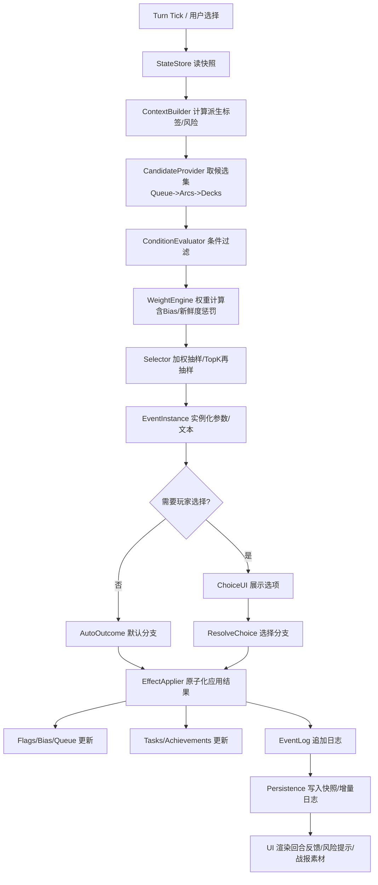
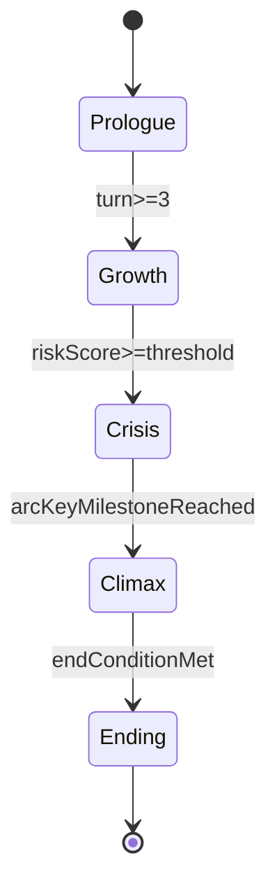
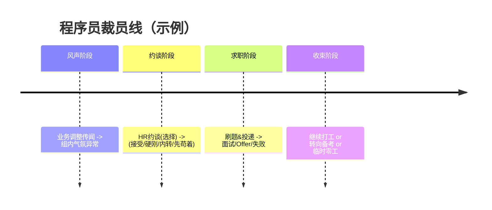
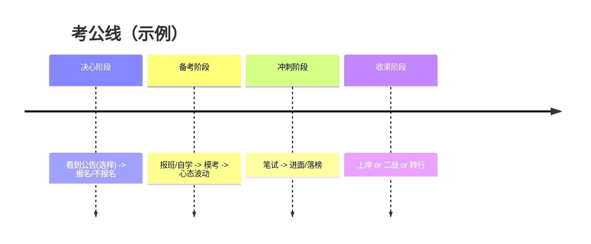
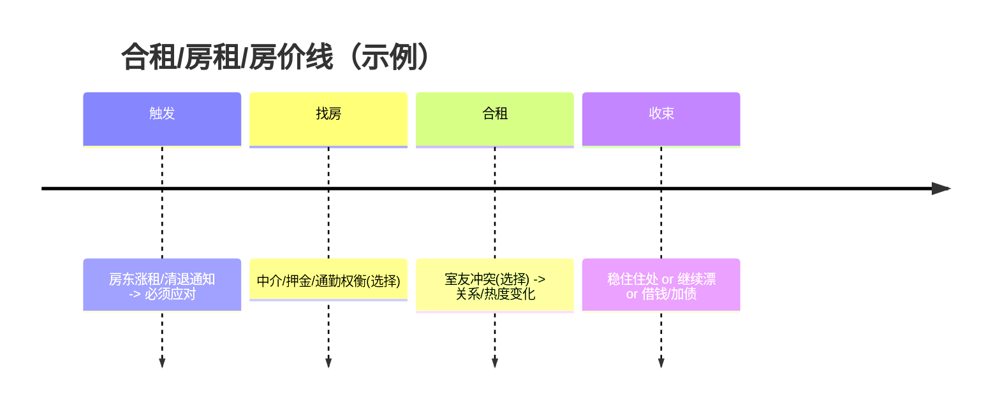

# 面向中国玩家的都市生存文字 MUD：链式事件引擎重构方案（可交付开发）

## 执行摘要

本报告给出一套“可落地、可扩容、可运营”的链式事件引擎重构方案，目标是把当前偏“随机事件堆砌”的文本挂机体验，升级为“角色驱动 + 状态机推进 + 事件链因果 + 可重复游玩但不重复”的都市生存模拟。方案借鉴并对齐了 Storylet / Quality-Based Narrative（QBN）体系的核心思想：用**可重排的叙事块（storylets）**作为内容单位，用**可持久化的品质/属性（qualities）**控制可用性、概率与后果，从而让玩家能“规划因果链”，而不是被动读随机段子。citeturn18view0turn18view2turn23view0turn23view1

结合你当前的产品形态（自动推进、关键节点决策、战报图分享），建议事件引擎采用“三层选择架构”：**强制队列（Queue）→ 活跃主线/支线弧（Arcs/Threads）→ 通用事件牌库（Decks）**，并通过 Flags（带 TTL）与 Bias（权重偏置）实现链式传播与回调（recall）。该方向与你现有“挂机推进 + 关键决策 + 结局复盘 + 可分享战报”的产品定位一致。citeturn14view0turn11view1

交付物包含：  
- 引擎高层架构（模块、数据流、状态机、标记与持久化策略）  
- 数据模型与 TS/JSON Schema（事件、分支、flags、玩家档案、环境/城市模板、职业、目标、长期任务、成就）  
- 支持条件触发、加权选择、链式传播、分支结果的事件生成算法伪代码  
- 三条完整事件链样例（程序员裁员线、考公线、合租/房租/房价线）与可直接前端消费的样例 JSON 文件  
- 文案与 UX 要点（本地化、写作约束、可分享结算卡格式）  
- 测试策略与指标体系（留存、分支覆盖、事件新鲜度、链条完成率）  
- 性能/扩展/编辑器建议，以及内容采集与合规/风控流程（含国内法规约束）citeturn16search2turn16search0turn17search6turn17search3turn16search5turn17search0

---

## 研究结论与参考框架

### 同类产品与现状对齐

你的现有版本（页面信息显示为“都市生存模拟器 / 文字挂机 MUD”）以**生命/精神/疲劳/债务/热度/章节**为核心状态，支持“掷骰生成角色→自动运行→生成战报图/分享文案”。这说明你已经具备：**可持久化状态、回合推进、结局复盘、可传播机制**等事件引擎最需要的外围能力。citeturn11view1turn14view0

同一赛道里，“US killline-like”产品（us-killline.com）在其介绍页强调“医疗账单、房租、信用卡债务”等现实压力，并以“paycheck to paycheck”的持续生存为循环。社区讨论中也出现“made-in-china American survival simulator”这类传播语境，说明此题材具备跨平台的“现实共鸣 + 梗化传播”潜力，但也更依赖**因果链**而非单点段子。citeturn12search3turn2search5

### 为什么 Storylet/QBN 是“链式事件引擎”的最佳范式

entity["organization","Failbetter Games","uk game studio"]在其叙事结构文章中明确提出：storylets 是可任意顺序游玩的“离散叙事块”，由 qualities（属性/计数器/物品等广义状态）控制解锁与分支可用性，且可以通过“由某个 quality 控制的一串相连 storylets”形成有开始-过程-结束的连续叙事（文中称 Questicles/ventures）。citeturn18view0

entity["people","Emily Short","interactive fiction author"]进一步把 storylet 系统拆解为“内容 + 前置（prerequisites）+ 结果（results）”的基本形态，并强调显式条件与成功率能让玩家规划风险、形成“需求→满足→解锁下一段”的链式意图。citeturn18view2

学术上，Kreminski & Wardrip-Fruin 给出 storylets 模型的结构化描述：叙事由“离散可重排模块”在运行中拼装；可用性由游戏状态决定；选择架构可用加权随机、salience（贴合度）或搜索等方式组合实现。citeturn23view0turn23view1

在“程序化叙事如何兼顾动态与连贯”上，Lume 系统指出：storylet 系统常见问题是“through-line（叙事主线）连贯性不足”，因此需要约束满足（constraints）、优先级、回调等机制来维持因果与一致性。citeturn22view0turn22view1

### 文案与写作组织的工程化建议

Failbetter 的写作指南强调：故事块应短（标题/分支一句话 + 正文一段），常被重复阅读的内容尤其应控制长度；重要信息前置，句子结构保持简单，以适应玩家“边玩边扫读”的注意力模型。citeturn18view1

---

## 事件引擎总体架构

### 设计目标与约束

在“挂机推进 + 关键决策”的形态下，引擎应该满足两个目标：  
第一，系统自动挑选事件时仍能让玩家感到“这是我这个角色会遇到的事”，而不是随机段子；第二，关键节点的选择必须可追溯地改变后续分布（链式传播），并能在战报卡中复盘为“因果路径”。这与 QBN/storylet 的“状态驱动选择 + 结果推动状态”天然一致。citeturn18view0turn18view2turn14view0

### 模块拆分与数据流



上述模块化拆分的重点是：  
- **CandidateProvider** 不再“全库扫描随机”，而是分层取候选（队列与弧线优先），保证故事能串起来。  
- **WeightEngine** 把“职业/城市/宏观环境/近期事件”统一映射为权重偏置（Bias），这是“链式感觉”的最小工程实现。citeturn23view1turn18view2

### 状态机分层：章节、叙事弧、队列

建议把“章节/阶段”从 UI 字段升级为**显式状态机**，并允许多个叙事弧并行（例如“裁员线”与“租房线”可同时活跃）。



- “章节状态”用于控制全局节奏与大事件密度（例如 Crisis 阶段提高强制事件比例、降低日常 filler）。  
- “叙事弧（Arc/Thread）”用 flags/counters 表示推进阶段，驱动下一批 storylets 的可用性（类似 Failbetter 文中“由 quality 控制的一串相连 storylets”）。citeturn18view0  
- “强制队列（Queue）”用于处理“事件后续”与确保因果回收（例如 HR 约谈后必进入“找工作/谈赔偿”的分支，而不是跳到“路边捡钱”）。这与 Emily Short 提到的“mandatory redirection”与 Lume 的“follow-up scenes/priority”思路一致。citeturn18view2turn22view1

### 持久化与可复盘

建议同时存两类数据：  
1) **Snapshot（快照）**：当前玩家状态、flags、bias、队列、活跃弧、冷却表；用于快速加载。  
2) **EventLog（增量日志）**：每回合选中事件、随机种子片段、分支选择、状态 delta；用于复盘、生成战报卡、回放、以及跑仿真测试（后文详述）。  

在你已有“seed/战报图/挑战链接”的产品机制下，建议把“seed + 事件日志哈希”纳入分享卡，确保同 seed 可重复（如果你希望“挑战模式”可复现）。citeturn11view1turn14view0

---

## 数据模型与 Schema

### 核心对象关系概览

- PlayerProfile：静态身份与长期属性（职业、教育、年龄、城市、家庭压力等）  
- PlayerState：可变数值状态（生命、精神、疲劳、债务、热度、现金、关系等）  
- WorldState：宏观环境标签（经济、政策、舆情）与城市模板（成本、机会、风险）  
- Flags：短期/中期的叙事记忆（带 TTL，可计数）  
- Bias：权重偏置（时间衰减），用于“刚发生过什么→接下来更容易发生什么”  
- Event：storylet 单元，含条件、权重、文本、分支、效果、后续调度  
- Arc：叙事弧的阶段计数与关键里程碑  
- Tasks / Achievements：长期目标与成就系统（用于中长期驱动与复盘）

### 城市模板（示例字段表）

| 城市ID | 城市名 | 生活成本基准 | 就业波动 | 舆情压力 | 典型事件标签倾向 |
|---|---|---:|---:|---:|---|
| bj | entity["city","北京","china"] | 高 | 高 | 高 | bigtech, policy, rent_high |
| sh | entity["city","上海","china"] | 高 | 中 | 中 | finance, rent_high, competition |
| sz | entity["city","深圳","china"] | 高 | 高 | 中 | startup, bigtech, volatility |
| cd | entity["city","成都","china"] | 中 | 中 | 低 | life_balance, exam, lower_stress |

（上表是“模板字段如何组织”的建议结构；具体数值应由你内测数据校准。）

### 环境标签（Environment Tags）建议

把宏观环境抽象成 tags + global modifiers（对权重与结局判定产生影响），避免写死“某年某政策”，更利于合规与长期运营。

| Tag | 含义 | 典型影响 |
|---|---|---|
| econ_downturn | 经济下行体感 | 求职成功率↓、裁员事件权重↑ |
| exam_fever | 考公热 | 报班/二战事件权重↑、家庭压力事件↑ |
| housing_shake | 楼市震荡/租房波动 | 涨租/搬家事件↑、债务风险↑ |
| public_opinion_hot | 舆情敏感期 | 热度系统更“锋利”，负面事件放大 |

对于“现实梗”的抽象，建议以“国内网络用语/话题标签”做语料层参考，但在系统层只用 neutral tags，以减少敏感内容的硬编码。citeturn5search2turn9search9

### 事件、分支、效果的 TypeScript Schema（可直接交付开发）

> 下面给出一份可直接用于 TS 项目与 JSON 校验的“核心接口”。你可以先按此落地，再逐步扩展（库存、NPC、地点子区域等）。（示例不含任何外部依赖，避免技术栈绑定。）

```ts
// schema.ts

export type StatKey =
  | "hp"          // 生命
  | "san"         // 精神
  | "fatigue"     // 疲劳
  | "debt"        // 债务
  | "heat"        // 热度/风险曝光
  | "cash"        // 现金
  | "careerXP"    // 职业经验
  | "examXP"      // 备考进度
  | "social"      // 社交/关系资源
  | "luck";       // 运势(可选)

export type CompareOp = "==" | "!=" | ">" | ">=" | "<" | "<=" | "in" | "notIn";

export type Condition =
  | { all: Condition[] }
  | { any: Condition[] }
  | { not: Condition }
  | { stat: StatKey; op: CompareOp; value: number | number[] }
  | { flag: string; op: CompareOp; value: boolean | number | string | (string | number)[] }
  | { hasTag: string }                           // context tags
  | { rng: { chance: number } };                 // 0..1, 用于小概率变体

export interface FlagValue {
  v: boolean | number | string;
  // 过期回合数（相对 turn），<=0 表示不过期
  ttl?: number;
}

export interface WeightModifier {
  if?: Condition;
  add?: number;        // 权重加成
  mul?: number;        // 权重乘数
  clampMin?: number;
  clampMax?: number;
}

export interface StatDelta {
  stat: StatKey;
  add: number;
  clampMin?: number;
  clampMax?: number;
}

export interface BiasDelta {
  // 对某类 tag 或某个 eventId 施加偏置
  key: string;         // "tag:bigtech" / "event:dev_layoff_hr_talk"
  mul: number;         // 权重乘数
  ttl: number;         // 持续回合
}

export interface QueueItem {
  eventId: string;
  dueIn: number;       // 多少回合后“到期”
  priority: number;    // 越大越优先
  forced?: boolean;    // true=强制（满足条件就必须出）
}

export interface Outcome {
  // 状态变化
  deltas?: StatDelta[];
  // 标记设置/清理
  setFlags?: Record<string, FlagValue>;
  clearFlags?: string[];
  // 队列：插入后续事件
  enqueue?: QueueItem[];
  // 权重偏置：推动链式传播
  bias?: BiasDelta[];
  // 弧线推进：例如 arc.devLayoff.stage += 1
  arcStep?: Record<string, number>;
  // 文本：分支结算文案（允许空，表示沿用 event 的默认）
  text?: string;
}

export interface Choice {
  id: string;
  label: string;
  // 分支是否可见/可选
  availableIf?: Condition;
  // 分支结果（可多段：先扣钱再进队列）
  outcomes: Outcome[];
}

export interface EventDef {
  id: string;
  version: number;

  // 分类与标签，供索引/统计/运营配置用
  category: "daily" | "career" | "system" | "arc" | "ending";
  tags: string[];          // e.g. ["bigtech","layoff","stress"]

  // 前置条件（不满足就不能进入候选集）
  when?: Condition;

  // 冷却与重复控制
  cooldown?: number;       // 触发后多少回合内不再出现
  oncePerRun?: boolean;    // 每局只触发一次

  // 权重体系
  baseWeight: number;
  weightMods?: WeightModifier[];

  // 文本与参数
  title: string;
  text: string;

  // 默认 outcome（无选择时执行；或作为“自动事件”）
  autoOutcomes?: Outcome[];

  // 玩家决策（存在 choices 则需要选择）
  choices?: Choice[];

  // 在日志/战报中展示的“标签化摘要”
  summaryTags?: string[]; // e.g. ["裁员","N+1","gap"]
}

export interface CareerDef {
  id: string;
  name: string;
  tags: string[];             // 影响候选池与权重
  startStats: Partial<Record<StatKey, number>>;
  salaryPerTurnRange: [number, number];
  stressBase: number;         // 每回合疲劳/精神的基线
}

export interface GoalDef {
  id: string;
  name: string;
  // 目标会在权重层面推动某些事件
  bias: BiasDelta[];
  // 结局判定权重（可选）
  endingWeights?: Record<string, number>;
}

export interface CityDef {
  id: string;
  name: string;
  tags: string[];
  rentBaseRange: [number, number];
  opportunity: number;        // 机会值
  volatility: number;         // 波动值
  heatSensitivity: number;    // 舆情/风险敏感度
  tagBias: BiasDelta[];       // 城市对事件tag的偏好
}

export interface EnvironmentDef {
  id: string;
  name: string;
  tags: string[];
  globalBias: BiasDelta[];
  globalMods: Partial<Record<StatKey, number>>; // 可用于每回合漂移
}
```

该 schema 显式支持**条件（when/availableIf）→ 权重（baseWeight + weightMods + bias）→ 结果（deltas/flags/queue）**的闭环，这正是 storylet/QBN 的工程化落地路径。citeturn18view0turn18view2turn23view1

---

## 事件生成与链式传播算法

### 选择架构：Queue → Arcs → Decks

Kreminski & Wardrip-Fruin 将“内容选择架构”视为 storylets 系统的关键维度：既可以让玩家从可用列表中选，也可以用随机/加权随机/贴合度/搜索等方式选。对“挂机推进 + 关键决策”形态而言，最稳妥的是：**系统做加权选择 + 在高价值节点让玩家做分支**。citeturn23view1turn14view0

在实现上，推荐三层：  
- **队列（Queue）**：确保因果后续能落地、避免叙事断裂（类似“mandatory redirection / follow-up scenes”）。citeturn18view2turn22view1  
- **弧线（Arcs）**：把“主线/支线”当成可并行的状态机，用 flags/counters 控制推进（对应 Failbetter 的“由 quality 控制的连接 storylets”）。citeturn18view0  
- **牌库（Decks）**：通用生活事件、职业事件、城市事件、环境事件，作为填充与变化来源。

### 伪代码：候选生成、权重计算、链式传播

```pseudo
function tickTurn(inputChoice?):
    state = loadSnapshot()

    if state.awaitingChoice:
        eventInst = state.awaitingChoice.event
        applyOutcomes(eventInst, inputChoice)
        finalizeTurn()
        return

    context = buildContext(state)
    // context.tags includes: career tags, city tags, env tags, risk tags, recent summary tags ...

    // 1) Queue 优先
    due = dequeueEligibleQueueItems(state.queue, state.turn, context)
    if due.hasForced:
        chosen = highestPriority(due.forcedThatPassConditions)
        return runEvent(chosen)

    // 2) Arcs 次优先：把活跃弧的“下一批事件”加入候选
    candidates = []
    candidates += arcCandidates(state.activeArcs, context)

    // 3) Decks：通用/职业/城市/环境事件池
    candidates += deckCandidates(context)

    // 4) 条件过滤 + 冷却过滤
    eligible = []
    for e in candidates:
        if !passesWhen(e.when, state, context): continue
        if isCoolingDown(e.id, state.cooldowns): continue
        if e.oncePerRun && state.seenEvents.contains(e.id): continue
        eligible.append(e)

    // 5) 计算权重 = baseWeight * (mods) * (bias) * (noveltyPenalty)
    scored = []
    for e in eligible:
        w = e.baseWeight
        w = applyWeightMods(w, e.weightMods, state, context)
        w = applyBias(w, state.biasMap, e.tags, e.id)
        w = w * noveltyPenalty(e.id, state.recentEvents)   // 降低重复
        if w <= 0: continue
        scored.append({event: e, weight: w})

    // 6) 抽样：可用 TopK 再加权抽样避免权重极端集中
    picked = weightedSample(scored, k = min(50, scored.size))

    return runEvent(picked)

function runEvent(eventDef):
    inst = instantiate(eventDef, state.rng)  // 生成随机参数、金额、文案变量
    logStart(inst)

    if inst.choices exists:
        state.awaitingChoice = inst
        saveSnapshot(state)
        renderChoice(inst)
        return

    applyAutoOutcomes(inst)
    finalizeTurn()

function applyOutcomes(eventInst, choiceId?):
    outcomes = resolveOutcomes(eventInst, choiceId)

    beginAtomicUpdate()
      applyStatDeltas(outcomes.deltas)
      setAndExpireFlags(outcomes.setFlags, outcomes.clearFlags)
      enqueueQueueItems(outcomes.enqueue)
      applyBiasDeltas(outcomes.bias)
      stepArcs(outcomes.arcStep)
      updateCooldownsAndSeen(eventInst)
      appendEventLog(eventInst, choiceId, outcomes)
    commitAtomicUpdate()

function finalizeTurn():
    state.turn += 1
    decayBiasAndFlagsTTL()
    persistSnapshotAndLog()
    renderTurnResult()
```

这套伪代码把 Emily Short 的“核心循环”（筛出满足 requirements 的 storylets → 呈现/选择 → 执行 results → 回到循环）完整映射到工程实现，只是把“呈现/选择”拆成“自动选择 + 关键节点决策”。citeturn18view2turn23view1

---

## 事件模板与示例事件池

### 模板写法约束（面向内容作者）

- 每个事件建议包含：标题（8–14 字）、正文（1 段）、可选分支（2–4 个）、分支结算文本（1–2 句）  
- 高频可重复事件必须更短；关键里程碑事件可略长，但通常不建议超过 4–5 段文本。citeturn18view1  
- 文案中“梗味”建议通过**比喻/语气/节奏**体现，而不是直接引用某个真实帖子的原句，避免版权与争议扩散（后文给出采集流程）。citeturn16search2turn17search0

下面给出三条完整链（每条 6–8 个事件节点），每个节点都包含：条件、状态变化、flags、后续 bias/queue、以及玩家选择分支。

### 事件链一：程序员裁员线（大厂/中厂通用）

叙事目标：从“风声”到“约谈”到“选择策略”到“短期结局（再就业/转行/考公/摆烂）”。



**可直接前端消费的样例文件：`events/dev_layoff_chain.json`**

```json
{
  "events": [
    {
      "id": "dev_layoff_rumor",
      "version": 1,
      "category": "arc",
      "tags": ["career_dev", "bigtech", "layoff", "stress"],
      "when": { "all": [
        { "hasTag": "career:dev" },
        { "not": { "flag": "dev.layoff.locked", "op": "==", "value": true } }
      ]},
      "cooldown": 6,
      "baseWeight": 8,
      "weightMods": [
        { "if": { "hasTag": "env:econ_downturn" }, "mul": 1.4 },
        { "if": { "stat": "fatigue", "op": ">=", "value": 60 }, "mul": 1.2 }
      ],
      "title": "业务调整的风声",
      "text": "周会上，老板用了三次“聚焦主航道”、两次“降本增效”。你看见同事在群里只回表情。空气里像有一条看不见的倒计时。",
      "autoOutcomes": [
        {
          "deltas": [
            { "stat": "san", "add": -6, "clampMin": 0, "clampMax": 100 },
            { "stat": "fatigue", "add": 4, "clampMin": 0, "clampMax": 100 },
            { "stat": "heat", "add": 2, "clampMin": 0, "clampMax": 100 }
          ],
          "setFlags": {
            "dev.layoff.rumor": { "v": true, "ttl": 12 },
            "dev.layoff.stage": { "v": 1, "ttl": 20 }
          },
          "bias": [
            { "key": "tag:layoff", "mul": 1.8, "ttl": 10 },
            { "key": "event:dev_hr_talk", "mul": 2.0, "ttl": 8 }
          ],
          "enqueue": [
            { "eventId": "dev_team_mood", "dueIn": 1, "priority": 50, "forced": false }
          ],
          "text": "你开始下意识地存聊天记录，甚至把工牌从桌面挪到抽屉里。"
        }
      ],
      "summaryTags": ["风声", "降本增效"]
    },
    {
      "id": "dev_team_mood",
      "version": 1,
      "category": "arc",
      "tags": ["career_dev", "layoff", "office"],
      "when": { "all": [
        { "flag": "dev.layoff.rumor", "op": "==", "value": true }
      ]},
      "cooldown": 4,
      "baseWeight": 10,
      "title": "组内气氛异常",
      "text": "工位上突然多了很多“低头写东西”的人：有人在改简历，有人在刷题，有人在看租房合同。你也开始计算：如果明天发生最坏的事，你还能撑几回合？",
      "autoOutcomes": [
        {
          "deltas": [
            { "stat": "san", "add": -4, "clampMin": 0, "clampMax": 100 },
            { "stat": "fatigue", "add": 3, "clampMin": 0, "clampMax": 100 }
          ],
          "bias": [
            { "key": "event:dev_hr_talk", "mul": 1.6, "ttl": 6 },
            { "key": "tag:jobhunt", "mul": 1.3, "ttl": 8 }
          ]
        }
      ],
      "summaryTags": ["办公室", "焦虑"]
    },
    {
      "id": "dev_hr_talk",
      "version": 1,
      "category": "arc",
      "tags": ["career_dev", "layoff", "choice", "hr"],
      "when": { "all": [
        { "flag": "dev.layoff.rumor", "op": "==", "value": true },
        { "stat": "san", "op": ">=", "value": 10 }
      ]},
      "oncePerRun": true,
      "baseWeight": 6,
      "weightMods": [
        { "if": { "hasTag": "env:econ_downturn" }, "mul": 1.5 }
      ],
      "title": "HR 约谈",
      "text": "邮件标题很短：『沟通一下』。HR 语气温柔得像一层泡沫：你在“优化名单边缘”，公司愿意“体面”处理。你知道，这里每个字都没有温度，只有成本。",
      "choices": [
        {
          "id": "take_pkg",
          "label": "接受补偿，尽快离场",
          "outcomes": [
            {
              "deltas": [
                { "stat": "cash", "add": 18000, "clampMin": -999999, "clampMax": 999999 },
                { "stat": "debt", "add": -6000, "clampMin": 0, "clampMax": 999999 },
                { "stat": "san", "add": -8, "clampMin": 0, "clampMax": 100 },
                { "stat": "heat", "add": 4, "clampMin": 0, "clampMax": 100 }
              ],
              "setFlags": {
                "dev.layoff.done": { "v": true, "ttl": 30 },
                "life.unemployed": { "v": true, "ttl": 18 }
              },
              "bias": [
                { "key": "tag:jobhunt", "mul": 2.0, "ttl": 12 },
                { "key": "tag:sidegig", "mul": 1.4, "ttl": 12 }
              ],
              "enqueue": [
                { "eventId": "dev_job_hunt_loop", "dueIn": 1, "priority": 80, "forced": false }
              ],
              "text": "你把“体面”两个字咽了回去，签字时手有点抖。"
            }
          ]
        },
        {
          "id": "negotiate",
          "label": "尝试谈更高补偿（高风险）",
          "outcomes": [
            {
              "deltas": [
                { "stat": "san", "add": -4, "clampMin": 0, "clampMax": 100 },
                { "stat": "heat", "add": 8, "clampMin": 0, "clampMax": 100 }
              ],
              "bias": [
                { "key": "event:dev_pkg_result", "mul": 2.2, "ttl": 5 }
              ],
              "enqueue": [
                { "eventId": "dev_pkg_result", "dueIn": 1, "priority": 90, "forced": true }
              ],
              "text": "你把话术改成“合理诉求”。HR 的微笑没变，但眼神像在记账。"
            }
          ]
        },
        {
          "id": "internal_transfer",
          "label": "申请内部转岗（看运气）",
          "outcomes": [
            {
              "deltas": [
                { "stat": "fatigue", "add": 6, "clampMin": 0, "clampMax": 100 },
                { "stat": "san", "add": -2, "clampMin": 0, "clampMax": 100 }
              ],
              "bias": [
                { "key": "event:dev_internal_transfer_result", "mul": 2.0, "ttl": 6 }
              ],
              "enqueue": [
                { "eventId": "dev_internal_transfer_result", "dueIn": 2, "priority": 70, "forced": true }
              ],
              "text": "你开始研究别的部门在做什么，像突然被迫学会“公司地图”。"
            }
          ]
        },
        {
          "id": "stall",
          "label": "先苟住，不表态",
          "outcomes": [
            {
              "deltas": [
                { "stat": "san", "add": -2, "clampMin": 0, "clampMax": 100 },
                { "stat": "fatigue", "add": 4, "clampMin": 0, "clampMax": 100 }
              ],
              "setFlags": {
                "dev.layoff.pip": { "v": true, "ttl": 10 }
              },
              "enqueue": [
                { "eventId": "dev_pip_week", "dueIn": 1, "priority": 60, "forced": false }
              ],
              "text": "你决定把今天当成普通的一天——只是喉咙更干。"
            }
          ]
        }
      ],
      "summaryTags": ["约谈", "选择"]
    },
    {
      "id": "dev_pkg_result",
      "version": 1,
      "category": "arc",
      "tags": ["career_dev", "layoff", "hr"],
      "when": { "any": [
        { "flag": "dev.layoff.rumor", "op": "==", "value": true }
      ]},
      "oncePerRun": true,
      "baseWeight": 1,
      "title": "补偿谈判结果",
      "text": "你收到一份“最终方案”。字面上给了你台阶，字缝里写着：别把事情搞大。",
      "choices": [
        {
          "id": "accept_higher",
          "label": "接受（略高补偿）",
          "outcomes": [
            {
              "deltas": [
                { "stat": "cash", "add": 26000, "clampMin": -999999, "clampMax": 999999 },
                { "stat": "debt", "add": -8000, "clampMin": 0, "clampMax": 999999 },
                { "stat": "san", "add": -6, "clampMin": 0, "clampMax": 100 }
              ],
              "setFlags": {
                "dev.layoff.done": { "v": true, "ttl": 30 },
                "life.unemployed": { "v": true, "ttl": 18 }
              },
              "enqueue": [
                { "eventId": "dev_job_hunt_loop", "dueIn": 1, "priority": 80, "forced": false }
              ],
              "text": "你赢了一点点，但心里并没有“赢”的感觉。"
            }
          ]
        },
        {
          "id": "push_hard",
          "label": "继续强硬（热度飙升）",
          "outcomes": [
            {
              "deltas": [
                { "stat": "heat", "add": 16, "clampMin": 0, "clampMax": 100 },
                { "stat": "san", "add": -10, "clampMin": 0, "clampMax": 100 }
              ],
              "setFlags": {
                "dev.layoff.locked": { "v": true, "ttl": 999 }
              },
              "enqueue": [
                { "eventId": "dev_forced_exit_bad", "dueIn": 1, "priority": 100, "forced": true }
              ],
              "text": "你感觉自己像把一根针戳进了泡沫——它破得悄无声息。"
            }
          ]
        }
      ],
      "summaryTags": ["谈判", "风险"]
    },
    {
      "id": "dev_job_hunt_loop",
      "version": 1,
      "category": "arc",
      "tags": ["career_dev", "jobhunt", "choice"],
      "when": { "all": [
        { "flag": "life.unemployed", "op": "==", "value": true },
        { "stat": "debt", "op": ">=", "value": 0 }
      ]},
      "cooldown": 2,
      "baseWeight": 12,
      "title": "投递与刷题",
      "text": "你把简历改成三种版本：保守、进攻、玄学。每天醒来第一件事是看邮箱，第二件事是怀疑自己。",
      "choices": [
        {
          "id": "grind",
          "label": "高强度刷题（更累但更可能拿 Offer）",
          "outcomes": [
            {
              "deltas": [
                { "stat": "fatigue", "add": 10, "clampMin": 0, "clampMax": 100 },
                { "stat": "san", "add": -5, "clampMin": 0, "clampMax": 100 },
                { "stat": "careerXP", "add": 6, "clampMin": 0, "clampMax": 999999 }
              ],
              "bias": [
                { "key": "event:dev_offer_or_reject", "mul": 1.6, "ttl": 4 }
              ],
              "enqueue": [
                { "eventId": "dev_offer_or_reject", "dueIn": 1, "priority": 60, "forced": false }
              ],
              "text": "你把焦虑写进了题解里。"
            }
          ]
        },
        {
          "id": "rest",
          "label": "休息一天（精神回血但时间在流逝）",
          "outcomes": [
            {
              "deltas": [
                { "stat": "fatigue", "add": -8, "clampMin": 0, "clampMax": 100 },
                { "stat": "san", "add": 6, "clampMin": 0, "clampMax": 100 },
                { "stat": "cash", "add": -1200, "clampMin": -999999, "clampMax": 999999 }
              ],
              "text": "你短暂地像个普通人——代价是现金在变薄。"
            }
          ]
        },
        {
          "id": "switch_exam",
          "label": "转向考公（换赛道）",
          "availableIf": { "all": [
            { "stat": "san", "op": ">=", "value": 15 }
          ]},
          "outcomes": [
            {
              "setFlags": {
                "goal.exam": { "v": true, "ttl": 999 }
              },
              "bias": [
                { "key": "tag:exam", "mul": 2.0, "ttl": 20 }
              ],
              "text": "你突然理解了“上岸”这两个字的重量。"
            }
          ]
        }
      ],
      "summaryTags": ["求职", "刷题"]
    },
    {
      "id": "dev_offer_or_reject",
      "version": 1,
      "category": "arc",
      "tags": ["career_dev", "jobhunt", "rng"],
      "when": { "flag": "life.unemployed", "op": "==", "value": true },
      "cooldown": 1,
      "baseWeight": 8,
      "title": "面试结果",
      "text": "电话那头说：我们很欣赏你，但……",
      "choices": [
        {
          "id": "offer",
          "label": "拿到 Offer（条件：运气 + 经验）",
          "availableIf": { "any": [
            { "stat": "careerXP", "op": ">=", "value": 12 },
            { "rng": { "chance": 0.25 } }
          ]},
          "outcomes": [
            {
              "deltas": [
                { "stat": "cash", "add": 8000, "clampMin": -999999, "clampMax": 999999 },
                { "stat": "san", "add": 12, "clampMin": 0, "clampMax": 100 },
                { "stat": "fatigue", "add": -6, "clampMin": 0, "clampMax": 100 }
              ],
              "clearFlags": ["life.unemployed"],
              "setFlags": {
                "life.employed": { "v": true, "ttl": 999 }
              },
              "text": "你笑了一下，发现自己已经很久没笑过。"
            }
          ]
        },
        {
          "id": "reject",
          "label": "被拒（更常见）",
          "outcomes": [
            {
              "deltas": [
                { "stat": "san", "add": -8, "clampMin": 0, "clampMax": 100 },
                { "stat": "cash", "add": -600, "clampMin": -999999, "clampMax": 999999 }
              ],
              "text": "你点开下一家岗位，像把自己折起来再塞回箱子。"
            }
          ]
        }
      ],
      "summaryTags": ["面试", "不确定"]
    },
    {
      "id": "dev_forced_exit_bad",
      "version": 1,
      "category": "arc",
      "tags": ["career_dev", "layoff", "ending_soft"],
      "baseWeight": 1,
      "title": "被迫离场",
      "text": "你还没等到“体面”，就先等到了“手续赶紧办”。你突然意识到：热度一旦上来，公司就只剩速度。",
      "autoOutcomes": [
        {
          "deltas": [
            { "stat": "cash", "add": 8000, "clampMin": -999999, "clampMax": 999999 },
            { "stat": "san", "add": -14, "clampMin": 0, "clampMax": 100 },
            { "stat": "heat", "add": 10, "clampMin": 0, "clampMax": 100 }
          ],
          "setFlags": {
            "life.unemployed": { "v": true, "ttl": 18 }
          },
          "text": "你获得了一个结论：有些胜负不是靠嘴赢的。"
        }
      ],
      "summaryTags": ["离场", "热度"]
    }
  ]
}
```

> 注：现实语境中“35 岁门槛/职业危机”属于国内玩家高共鸣主题，但在内容层应避免指向具体企业或个体，建议以抽象机制表达（例如 `age>=35` 影响 `jobhunt` 权重），并在合规层建立“名誉权/谣言风险”规则（后文详述）。citeturn8search13turn17search0

---

### 事件链二：考公线（报名—备考—考试—面试—上岸/二战）

考公叙事非常适合 storylet：它天然是阶段性推进（公告→报名→学→考→面），并且可以用 flags/counters 精确控制节奏，同时提供大量可重复但不重复的“日常变体”（模考、背诵、焦虑、家庭压力）。国内网络语境中“上岸/二战/报班”等高频词可作为文案风格参考。citeturn5search2turn9search9



**样例文件：`events/exam_chain.json`**

```json
{
  "events": [
    {
      "id": "exam_notice_seen",
      "version": 1,
      "category": "arc",
      "tags": ["exam", "choice", "family"],
      "when": { "not": { "flag": "exam.locked", "op": "==", "value": true } },
      "cooldown": 8,
      "baseWeight": 7,
      "weightMods": [
        { "if": { "hasTag": "env:exam_fever" }, "mul": 1.6 }
      ],
      "title": "公告弹出来了",
      "text": "你刷到一条消息：今年岗位很多，但竞争更狠。你看着“稳定”两个字，像看见一条又窄又长的桥。",
      "choices": [
        {
          "id": "commit",
          "label": "报名，正式进入备考状态",
          "outcomes": [
            {
              "setFlags": {
                "exam.active": { "v": true, "ttl": 999 },
                "exam.stage": { "v": 1, "ttl": 999 }
              },
              "deltas": [
                { "stat": "san", "add": -2, "clampMin": 0, "clampMax": 100 },
                { "stat": "examXP", "add": 3, "clampMin": 0, "clampMax": 999999 }
              ],
              "bias": [
                { "key": "tag:exam", "mul": 2.0, "ttl": 20 }
              ],
              "enqueue": [
                { "eventId": "exam_daily_study", "dueIn": 1, "priority": 60, "forced": false }
              ],
              "text": "你告诉自己：就当给人生多开一条分支。"
            }
          ]
        },
        {
          "id": "skip",
          "label": "先不报，观望",
          "outcomes": [
            {
              "deltas": [
                { "stat": "san", "add": 2, "clampMin": 0, "clampMax": 100 }
              ],
              "text": "你把屏幕按灭，短暂地松了一口气。"
            }
          ]
        }
      ],
      "summaryTags": ["公告", "选择"]
    },
    {
      "id": "exam_daily_study",
      "version": 1,
      "category": "arc",
      "tags": ["exam", "daily", "choice"],
      "when": { "flag": "exam.active", "op": "==", "value": true },
      "cooldown": 1,
      "baseWeight": 12,
      "title": "今天学不学？",
      "text": "你面前是题库和笔记。你知道进度会积累，崩溃也会。",
      "choices": [
        {
          "id": "hard",
          "label": "高强度（进度快，精神损耗大）",
          "outcomes": [
            {
              "deltas": [
                { "stat": "examXP", "add": 8, "clampMin": 0, "clampMax": 999999 },
                { "stat": "san", "add": -6, "clampMin": 0, "clampMax": 100 },
                { "stat": "fatigue", "add": 6, "clampMin": 0, "clampMax": 100 }
              ],
              "bias": [
                { "key": "event:exam_mock", "mul": 1.4, "ttl": 4 }
              ],
              "enqueue": [
                { "eventId": "exam_mock", "dueIn": 1, "priority": 40, "forced": false }
              ],
              "text": "你把一整天拆成了很多个 25 分钟。"
            }
          ]
        },
        {
          "id": "steady",
          "label": "稳定推进（更可持续）",
          "outcomes": [
            {
              "deltas": [
                { "stat": "examXP", "add": 5, "clampMin": 0, "clampMax": 999999 },
                { "stat": "san", "add": -2, "clampMin": 0, "clampMax": 100 },
                { "stat": "fatigue", "add": 3, "clampMin": 0, "clampMax": 100 }
              ],
              "text": "你不求燃烧，只求不断。"
            }
          ]
        },
        {
          "id": "break",
          "label": "摆一天（精神回血但进度停滞）",
          "outcomes": [
            {
              "deltas": [
                { "stat": "san", "add": 6, "clampMin": 0, "clampMax": 100 },
                { "stat": "cash", "add": -200, "clampMin": -999999, "clampMax": 999999 }
              ],
              "text": "你刷了很久短视频，越刷越空。"
            }
          ]
        }
      ],
      "summaryTags": ["备考", "日常"]
    },
    {
      "id": "exam_mock",
      "version": 1,
      "category": "arc",
      "tags": ["exam", "daily", "rng"],
      "when": { "flag": "exam.active", "op": "==", "value": true },
      "cooldown": 2,
      "baseWeight": 10,
      "title": "模考分数",
      "text": "分数出来了。你盯着那条折线，像盯着自己这段时间的命运。",
      "autoOutcomes": [
        {
          "deltas": [
            { "stat": "san", "add": -2, "clampMin": 0, "clampMax": 100 }
          ],
          "bias": [
            { "key": "event:exam_family_pressure", "mul": 1.3, "ttl": 6 }
          ],
          "text": "你决定把分数藏起来，只告诉别人“还行”。"
        }
      ],
      "summaryTags": ["模考"]
    },
    {
      "id": "exam_family_pressure",
      "version": 1,
      "category": "arc",
      "tags": ["exam", "family", "choice"],
      "when": { "flag": "exam.active", "op": "==", "value": true },
      "cooldown": 5,
      "baseWeight": 7,
      "title": "家里开始问了",
      "text": "家里人问得很轻：最近学习怎么样？但你听见的是另一句：你打算什么时候“稳定”？",
      "choices": [
        {
          "id": "explain",
          "label": "解释压力（短痛）",
          "outcomes": [
            {
              "deltas": [
                { "stat": "san", "add": -3, "clampMin": 0, "clampMax": 100 },
                { "stat": "social", "add": 2, "clampMin": 0, "clampMax": 999999 }
              ],
              "text": "你说得很认真，但对方只记住了“难”。"
            }
          ]
        },
        {
          "id": "hide",
          "label": "敷衍过去（长痛）",
          "outcomes": [
            {
              "deltas": [
                { "stat": "san", "add": -1, "clampMin": 0, "clampMax": 100 }
              ],
              "setFlags": {
                "exam.guilt": { "v": true, "ttl": 8 }
              },
              "text": "你说“挺好的”，然后更不敢停下。"
            }
          ]
        }
      ],
      "summaryTags": ["家庭压力"]
    },
    {
      "id": "exam_written_test",
      "version": 1,
      "category": "arc",
      "tags": ["exam", "milestone", "choice"],
      "when": { "all": [
        { "flag": "exam.active", "op": "==", "value": true },
        { "stat": "examXP", "op": ">=", "value": 25 }
      ]},
      "oncePerRun": true,
      "baseWeight": 4,
      "title": "笔试那天",
      "text": "你提前一小时到考点。风很冷，考场很亮。你坐下时突然想：这条路上，所有人都在假装不紧张。",
      "choices": [
        {
          "id": "push",
          "label": "拼到最后一秒",
          "outcomes": [
            {
              "deltas": [
                { "stat": "san", "add": -8, "clampMin": 0, "clampMax": 100 },
                { "stat": "fatigue", "add": 10, "clampMin": 0, "clampMax": 100 }
              ],
              "enqueue": [
                { "eventId": "exam_result", "dueIn": 1, "priority": 90, "forced": true }
              ],
              "text": "你交卷时手心全是汗。"
            }
          ]
        },
        {
          "id": "steady",
          "label": "稳住节奏，不赌命",
          "outcomes": [
            {
              "deltas": [
                { "stat": "san", "add": -4, "clampMin": 0, "clampMax": 100 },
                { "stat": "fatigue", "add": 6, "clampMin": 0, "clampMax": 100 }
              ],
              "enqueue": [
                { "eventId": "exam_result", "dueIn": 1, "priority": 90, "forced": true }
              ],
              "text": "你知道自己没发挥到极限，但至少没崩。"
            }
          ]
        }
      ],
      "summaryTags": ["笔试", "里程碑"]
    },
    {
      "id": "exam_result",
      "version": 1,
      "category": "arc",
      "tags": ["exam", "rng", "milestone"],
      "oncePerRun": true,
      "baseWeight": 1,
      "title": "成绩与进面",
      "text": "名单出来了。",
      "choices": [
        {
          "id": "in",
          "label": "进面（条件：进度或运气）",
          "availableIf": { "any": [
            { "stat": "examXP", "op": ">=", "value": 40 },
            { "rng": { "chance": 0.28 } }
          ]},
          "outcomes": [
            {
              "setFlags": {
                "exam.interview": { "v": true, "ttl": 10 }
              },
              "deltas": [
                { "stat": "san", "add": 10, "clampMin": 0, "clampMax": 100 }
              ],
              "text": "你看见自己的名字时，第一反应不是开心，而是：下一关。"
            }
          ]
        },
        {
          "id": "out",
          "label": "落榜",
          "outcomes": [
            {
              "deltas": [
                { "stat": "san", "add": -12, "clampMin": 0, "clampMax": 100 }
              ],
              "setFlags": {
                "exam.failed": { "v": true, "ttl": 8 }
              },
              "enqueue": [
                { "eventId": "exam_second_try", "dueIn": 1, "priority": 60, "forced": false }
              ],
              "text": "你盯着屏幕，像盯着一扇关上的门。"
            }
          ]
        }
      ],
      "summaryTags": ["放榜"]
    },
    {
      "id": "exam_second_try",
      "version": 1,
      "category": "arc",
      "tags": ["exam", "choice", "ending_soft"],
      "when": { "flag": "exam.failed", "op": "==", "value": true },
      "oncePerRun": true,
      "baseWeight": 5,
      "title": "要不要二战？",
      "text": "你意识到：你不只是考一个岗位，你在考一种生活的可能性。",
      "choices": [
        {
          "id": "retry",
          "label": "二战（继续投入）",
          "outcomes": [
            {
              "deltas": [
                { "stat": "san", "add": -6, "clampMin": 0, "clampMax": 100 },
                { "stat": "examXP", "add": 8, "clampMin": 0, "clampMax": 999999 }
              ],
              "clearFlags": ["exam.failed"],
              "text": "你把失败吞下去，再把自己推回起跑线。"
            }
          ]
        },
        {
          "id": "stop",
          "label": "止损，换路线",
          "outcomes": [
            {
              "setFlags": {
                "exam.locked": { "v": true, "ttl": 999 }
              },
              "deltas": [
                { "stat": "san", "add": 2, "clampMin": 0, "clampMax": 100 }
              ],
              "text": "你没赢，但也没再把自己押上去。"
            }
          ]
        }
      ],
      "summaryTags": ["二战", "分支"]
    }
  ]
}
```

---

### 事件链三：合租/房租/房价线（搬家、室友、债务与压力）

这条线的关键是：用城市模板与环境标签驱动“成本压力”，并用队列确保“房东通知→找房→签约→押金/中介→室友冲突”的**连续性**。同时可用热搜式话题作为“事件皮肤”，例如 Tieba 热门话题里常见的“低价出租屋/网贷/家庭财务冲突”等叙事原型（注意只取原型、不复刻原文）。citeturn9search9turn16search2



**样例文件：`events/housing_roommate_chain.json`**

```json
{
  "events": [
    {
      "id": "rent_landlord_notice",
      "version": 1,
      "category": "system",
      "tags": ["housing", "rent", "forced", "choice"],
      "when": { "all": [
        { "stat": "cash", "op": ">=", "value": -999999 }
      ]},
      "cooldown": 10,
      "baseWeight": 5,
      "weightMods": [
        { "if": { "hasTag": "env:housing_shake" }, "mul": 1.8 }
      ],
      "title": "房东发来消息",
      "text": "房东说：下个月要涨租，或者你们提前走也行。语气很客气，意思很明确：选择权不在你。",
      "choices": [
        {
          "id": "pay_more",
          "label": "硬扛涨租（现金压力）",
          "availableIf": { "stat": "cash", "op": ">=", "value": 1500 },
          "outcomes": [
            {
              "deltas": [
                { "stat": "cash", "add": -1500, "clampMin": -999999, "clampMax": 999999 },
                { "stat": "san", "add": -3, "clampMin": 0, "clampMax": 100 }
              ],
              "setFlags": {
                "housing.stable": { "v": true, "ttl": 8 },
                "housing.rent_up": { "v": true, "ttl": 8 }
              },
              "text": "你稳住了居住权，但也稳住了焦虑。"
            }
          ]
        },
        {
          "id": "move_out",
          "label": "搬家（进入找房链）",
          "outcomes": [
            {
              "setFlags": {
                "housing.searching": { "v": true, "ttl": 12 }
              },
              "bias": [
                { "key": "tag:housing", "mul": 2.0, "ttl": 10 }
              ],
              "enqueue": [
                { "eventId": "rent_house_hunt", "dueIn": 1, "priority": 90, "forced": true }
              ],
              "text": "你开始在地图上重新认识这座城市。"
            }
          ]
        }
      ],
      "summaryTags": ["涨租", "居住"]
    },
    {
      "id": "rent_house_hunt",
      "version": 1,
      "category": "arc",
      "tags": ["housing", "choice", "commute"],
      "when": { "flag": "housing.searching", "op": "==", "value": true },
      "baseWeight": 1,
      "title": "开始找房",
      "text": "你发现租房只有三件事：通勤、价格、室友。你最多能同时拥有两件。",
      "choices": [
        {
          "id": "near_work",
          "label": "选离工作近的（更贵）",
          "outcomes": [
            {
              "deltas": [
                { "stat": "cash", "add": -2000, "clampMin": -999999, "clampMax": 999999 },
                { "stat": "fatigue", "add": -4, "clampMin": 0, "clampMax": 100 }
              ],
              "enqueue": [
                { "eventId": "rent_sign_contract", "dueIn": 1, "priority": 80, "forced": true }
              ],
              "text": "你买到的是时间，不是房子。"
            }
          ]
        },
        {
          "id": "far_cheaper",
          "label": "选远一点的（更便宜但更累）",
          "outcomes": [
            {
              "deltas": [
                { "stat": "cash", "add": -900, "clampMin": -999999, "clampMax": 999999 },
                { "stat": "fatigue", "add": 6, "clampMin": 0, "clampMax": 100 }
              ],
              "enqueue": [
                { "eventId": "rent_sign_contract", "dueIn": 1, "priority": 80, "forced": true }
              ],
              "text": "你每天都会在路上想：我到底图什么。"
            }
          ]
        },
        {
          "id": "share_room",
          "label": "合租（省钱但引入室友变量）",
          "outcomes": [
            {
              "deltas": [
                { "stat": "cash", "add": -1100, "clampMin": -999999, "clampMax": 999999 }
              ],
              "setFlags": {
                "housing.roommate": { "v": true, "ttl": 20 }
              },
              "enqueue": [
                { "eventId": "roommate_conflict", "dueIn": 2, "priority": 70, "forced": false },
                { "eventId": "rent_sign_contract", "dueIn": 1, "priority": 80, "forced": true }
              ],
              "text": "你把不确定性签进了合同。"
            }
          ]
        }
      ],
      "summaryTags": ["找房", "权衡"]
    },
    {
      "id": "rent_sign_contract",
      "version": 1,
      "category": "arc",
      "tags": ["housing", "contract"],
      "baseWeight": 1,
      "title": "签合同与押金",
      "text": "押一付三、服务费、杂项，你看着付款页面，像看着一段缩小版人生：钱不够的时候，规则特别清晰。",
      "autoOutcomes": [
        {
          "deltas": [
            { "stat": "cash", "add": -1200, "clampMin": -999999, "clampMax": 999999 },
            { "stat": "san", "add": -2, "clampMin": 0, "clampMax": 100 }
          ],
          "clearFlags": ["housing.searching"],
          "setFlags": {
            "housing.stable": { "v": true, "ttl": 10 }
          },
          "text": "你暂时有了住处，也暂时没有了余钱。"
        }
      ],
      "summaryTags": ["押金", "合同"]
    },
    {
      "id": "roommate_conflict",
      "version": 1,
      "category": "arc",
      "tags": ["housing", "roommate", "choice", "social"],
      "when": { "flag": "housing.roommate", "op": "==", "value": true },
      "cooldown": 6,
      "baseWeight": 10,
      "title": "室友变量开始生效",
      "text": "室友把公共区域当成“暂存区”，你把它当成“生存区”。你们都没错，只是都很累。",
      "choices": [
        {
          "id": "talk",
          "label": "沟通（看精神值）",
          "availableIf": { "stat": "san", "op": ">=", "value": 20 },
          "outcomes": [
            {
              "deltas": [
                { "stat": "san", "add": 3, "clampMin": 0, "clampMax": 100 },
                { "stat": "social", "add": 2, "clampMin": 0, "clampMax": 999999 }
              ],
              "setFlags": {
                "housing.roommate.peace": { "v": true, "ttl": 8 }
              },
              "text": "你们达成了一个成年人协议：不解决问题，至少不升级战争。"
            }
          ]
        },
        {
          "id": "endure",
          "label": "忍（精神慢性掉血）",
          "outcomes": [
            {
              "deltas": [
                { "stat": "san", "add": -5, "clampMin": 0, "clampMax": 100 }
              ],
              "text": "你没吵架，但你每天都在心里吵。"
            }
          ]
        },
        {
          "id": "explode",
          "label": "爆发（热度上升，风险）",
          "outcomes": [
            {
              "deltas": [
                { "stat": "heat", "add": 10, "clampMin": 0, "clampMax": 100 },
                { "stat": "san", "add": -8, "clampMin": 0, "clampMax": 100 }
              ],
              "enqueue": [
                { "eventId": "housing_move_again", "dueIn": 2, "priority": 70, "forced": false }
              ],
              "text": "你赢了这场嘴仗，却输掉了这段日子。"
            }
          ]
        }
      ],
      "summaryTags": ["室友", "冲突"]
    },
    {
      "id": "housing_move_again",
      "version": 1,
      "category": "arc",
      "tags": ["housing", "ending_soft"],
      "baseWeight": 6,
      "title": "再次搬家",
      "text": "你开始怀疑：是不是城市不适合你？后来你又想起：也许只是你没有足够的钱来适配城市。",
      "autoOutcomes": [
        {
          "deltas": [
            { "stat": "fatigue", "add": 8, "clampMin": 0, "clampMax": 100 },
            { "stat": "cash", "add": -800, "clampMin": -999999, "clampMax": 999999 }
          ],
          "setFlags": {
            "housing.searching": { "v": true, "ttl": 10 }
          },
          "enqueue": [
            { "eventId": "rent_house_hunt", "dueIn": 1, "priority": 80, "forced": true }
          ],
          "text": "你叠好了纸箱，也叠好了一点点尊严。"
        }
      ],
      "summaryTags": ["漂", "搬家"]
    }
  ]
}
```

---

## 前端消费与 UX 文案规范

### UI 信息结构：让玩家“看得懂因果”

Emily Short 指出，显式呈现“解锁条件/成功率”虽然会“更像游戏”，但能换来玩家的规划感与可预期的风险承担，从而减少“被坑”的体验，同时促进“我需要先做 X 才能解锁 Y”这种链式意图。citeturn18view2

结合你现有 UI（“回合反馈/变化/下回合风险/生存仪表/章节/日志/战报图”），建议增加三类“轻量可视化因果信息”：

1) **事件来源标识**：显示该事件来自 `队列/主线弧/职业牌库/城市牌库/环境牌库`（用小标签即可）。  
2) **主要触发因子提示**（不需要暴露全部条件）：例如“触发因子：疲劳↑、债务↑、裁员风声”。  
3) **后续预告（软提示）**：对 enqueue 的强制后续给“下一回合你大概率要面对：X”的提示（你已有“下回合风险”，可直接复用）。citeturn11view1turn14view0

### 中文本地化与“梗味”写作

- 不要依赖“长段抒情”。更多用短句、断句、对照（“语气很客气/意思很明确”）来制造黑色幽默，符合“短块阅读”的交互节奏。citeturn18view1  
- “国内网络语境”可以用作“语气谱系”参考（例如“上岸/二战/降本增效/体面离场”等），但要避免指向具体企业、具体个人或可验证的真实指控，以降低名誉权/谣言风险。citeturn17search0turn16search2  
- 对于地域差异，优先用“生活成本/通勤/机会/波动”映射，而不是直接写刻板地域评价；把差异放在系统层（城市模板），文案层只做“生活感细节”。

### 结算战报卡格式（可传播但可控）

你已有“导出战报图+文字总结+挑战链接”的分享机制。citeturn14view0turn11view1  
建议统一战报卡数据结构，确保“复盘清晰 + 不泄露隐私 + 易二创”。

**样例文件：`run_summary_card.json`**

```json
{
  "runId": "20260226-8f3c",
  "seed": "DEV-114514",
  "cityId": "sh",
  "careerId": "dev",
  "environmentId": "econ_downturn",
  "turnsSurvived": 38,
  "endingId": "ending_employed_low_san",
  "finalStats": {
    "hp": 62,
    "san": 18,
    "fatigue": 74,
    "debt": 12000,
    "heat": 35,
    "cash": 3800,
    "careerXP": 20,
    "examXP": 0,
    "social": 6
  },
  "highlights": [
    "业务调整风声 → HR约谈 → 体面离场",
    "连续 5 回合求职事件",
    "合租冲突 1 次（已压下）"
  ],
  "memeTags": ["降本增效", "体面离场", "投递地狱"],
  "arcOutcomes": {
    "devLayoff": "再就业（低精神）",
    "housing": "住处稳定（高疲劳）"
  },
  "shareText": "你在本局撑了 38 回合：没倒下，但也没赢。"
}
```

---

## 测试、指标与运营合规

### 测试策略：既测“系统正确”，也测“叙事覆盖”

1) **Schema 校验 + 内容 lint**：  
   - JSON Schema/TS 类型校验（字段必填、op 合法、引用 eventId 存在）。  
   - 文案 lint（标题长度、敏感词占位、变量占位符完整性）。  

2) **确定性回放测试（Replay）**：  
   - 固定 seed + 固定选择序列 → 结果必须一致（验证 RNG、队列与 bias 衰减无漂移）。  
   - 对应你现有“seed/挑战链接”的产品能力，回放一致性会直接提升“挑战模式”可信度。citeturn11view1turn14view0

3) **蒙特卡洛仿真（Simulation）**：  
   每次构建跑 10k–100k 局（可在 CI 夜间跑），输出：  
   - 事件重复率（Top-N 事件占比）  
   - 三条示例链的完成率、平均回合长度、分支覆盖率  
   - 关键状态分布（精神归零概率、债务爆表概率）  
   - 新鲜度指标（见下）

4) **内容回归与分支覆盖（Branch Coverage）**：  
   - 统计每个 event 的触发次数、每个 choice 的选择次数，确保“写了的内容能被看到”。  
   - 对“强制队列”事件要求 90%+ 的可达率（否则说明条件过严或队列策略失效）。  

### 指标体系：留存 + 叙事链质量

建议把指标分三组（可直接埋点到 EventLog 聚合）：

- 留存与游玩：D1/D3/D7、平均每局回合数、平均每次会话回合数、二刷率、分享率。  
- 叙事链：  
  - `ArcCompletionRate`（每条链自然收束到阶段结局的比例）  
  - `ChainCoherenceScore`（队列事件命中率 + 关键 flag 回调率的加权）  
- 新鲜度：  
  - `EventNovelty`：最近 N 回合内重复事件比例  
  - `Gini(事件分布)`：衡量是否被少数事件垄断  
  - `UniqueHighlightsPerRun`：每局可用于战报卡的“高光摘要”数量（太少=无聊，太多=混乱）

### 性能、可扩展与内容工程

当事件量从 200 增长到 2000+ 时，性能瓶颈常出在“全库条件评估”。解决方案：

- **索引化候选池**：按 tags/必需 flags 建倒排索引（例如 `tag:career_dev → eventIds[]`），CandidateProvider 先缩小候选，再做表达式求值。  
- **条件编译**：把 Condition AST 编译成可执行函数（避免每回合解释器开销）。  
- **冷却与 recentlySeen** 用 O(1) 哈希结构。  
- **偏置（Bias）衰减** 用小表维护（只存活跃 bias）。  

内容工程建议延续 Failbetter 提到的“用表格拆分 storylets/分支”的方式：作者在表格/YAML 写，构建时编译成 JSON，并做一致性检查。citeturn18view1turn18view0turn18view2

### 内容采集工作流（Tieba 风格）与合规/风控要点

#### 采集与加工流程（建议 SOP）

1) **选题池**：从贴吧热榜/话题页与相关吧的高频主题抽象“叙事原型”（例如：涨租、裁员、报班贷款、室友冲突、临时零工）。Tieba 热门话题页提供了“现实压力叙事”的典型素材入口，但建议只取主题结构，不复刻表达。citeturn9search9turn9search29  
2) **原型抽象**：把“吐槽段子”改写为“可系统化的冲突-选择-后果”。  
3) **机制绑定**：每个原型必须回答：触发条件是什么？影响哪些 Stat？设置哪些 Flags？推动哪些后续 Bias/Queue？  
4) **敏感性分级**：政治、指向性很强的社会事件、可识别企业/个人、医疗纠纷等题材进入“高风险池”，默认不上线或只做高度抽象替换。  
5) **灰度发布**：新事件先进入 A/B small deck，观察投诉率、分享率、跳出率。

#### 法规与平台责任边界（高层提醒）

- 在entity["country","中国","people's republic of china"]境内提供网络信息服务与内容分发，需要关注网信部门对“违法和不良信息”的治理框架；《网络信息内容生态治理规定》明确提出平台主体责任与内容治理目标（清朗网络空间等）。citeturn16search2  
- 若你的产品涉及用户账号、日志与可分享内容，需满足个人信息保护与数据安全要求；《个人信息保护法》与《数据安全法》分别对个人信息处理规则与数据处理活动提出要求。citeturn16search0turn17search3  
- 若允许用户生成内容（UGC）或在分享文案中映射真实主体，需注意名誉权与侵权风险；《民法典》明确名誉权保护与“侮辱/诽谤”的禁止性条款，且对公共利益的新闻报道/舆论监督边界也有规定。citeturn17search0turn17search8  
- 若面向未成年人，在线游戏还需考虑防沉迷与实名制等监管要求（国家新闻出版署相关通知）。citeturn16search5  
- 《网络安全法》对网络运营者的安全义务与个人信息保护亦有要求（作为基础合规底座）。citeturn17search6  

> 实操建议：在“战报分享文案”中禁用可指向具体企业/个人的断言式文本；所有“现实梗”都走“原型抽象 + 中性化改写 + 审核白名单”流程；日志与分享卡默认不包含任何可识别个人信息（手机号、定位、真实姓名等）。citeturn16search0turn17search0turn16search2

---